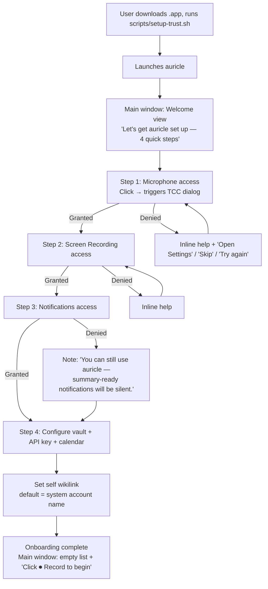
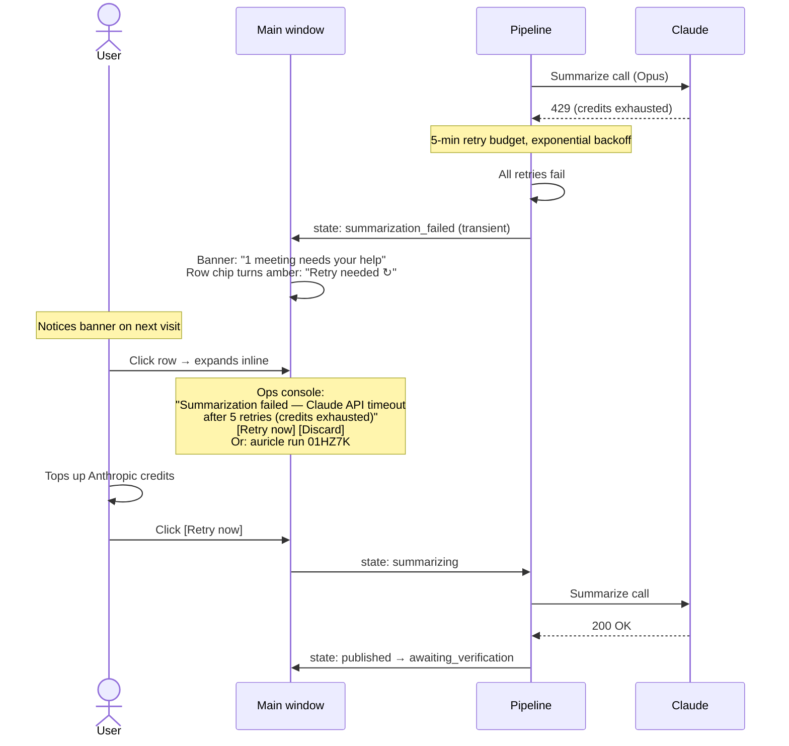

# UX Design Specification — auricle

**Author:** arunderwood
**Date:** 2026-04-30

---

## Executive Summary

### Project Vision

auricle is a single-user, local-first macOS app that turns meetings into structured Obsidian notes without joining the call. Capture happens silently at the OS layer (ScreenCaptureKit loopback + mic); transcription, diarization, vault-glossary correction, and persistence all run on-device; only summarization may make a remote call (Claude). The user clicks Record, has the meeting, clicks Stop, blocks briefly on a native speaker-attribution step, then receives a macOS notification ~1–2 minutes later — a single click opens the resulting note in Obsidian and arms the 7-day audio-retention timer.

The UX premise is the elimination of the meeting-notes tax: *Be in the meeting. Not in your notes.*

### Target Users

A single human user, observed across multiple modes rather than multiple personas. They are an independent engineer/maker, attend 10–25 voice meetings per week across Zoom / Google Meet / Discord / FaceTime, and maintain a personal Obsidian vault at `~/checkouts/SecondBrain` that they treat as working memory. They are highly tech-savvy and comfortable in a terminal.

The eight UX-relevant modes that shape the surface:

- **Composed (J1):** time to attribute carefully; the happy path
- **Time-pressed (J2):** 8 minutes between calls; "Publish anyway" must be a first-class affordance
- **Embarrassed (J3):** captured the wrong thing; wants clean discard, no vault residue
- **Frustrated (J4):** GUI broken or unavailable; falls back to terminal
- **Reflective (J5):** this meeting matters; override retention to keep audio indefinitely
- **Onboarding (J0):** first launch on a fresh Mac; TCC permission dance
- **Interrupted (J6):** Anthropic credits exhausted mid-summarize; needs resume affordance
- **Mobile (J8):** laptop slept mid-capture; capture-stage must classify and recover

### Key Design Challenges

1. **Attribution is the differentiating UX surface, AND it's where the user is most time-pressed.** Per-speaker audio snippets, calendar-marked autocomplete with a strict priority order (calendar attendees → vault wikilinks → previously-labeled), "this is me" self-attribution, and a prominent "Publish anyway" affordance all need to coexist legibly, accessibly (keyboard navigation + Spacebar playback per NFR-A2), and quickly.

2. **State legibility without overwhelm.** A meeting moves through ~12 canonical states. The main window must communicate per-meeting state at a glance (color + label, color-not-sole-conveyor per NFR-A3) while supporting drill-in for in-flight detail (e.g., *"Retry 3 of 5 — next attempt in 4s"* with an inline "Stop trying" button per Decision 4.2).

3. **No silent losses (the failure-visibility contract from Decision 4.6).** Captured meetings can never sit unverified or in a *_failed state without surfacing somewhere the user will see them — main-window banner on launch, list-sort by staleness, `auricle doctor` summary, and (v1.1) Dock badge.

4. **App-lifecycle mental model.** The app stays alive on window-close; capture continues in background; attribution resumes on next window open. This subverts the "close = quit" expectation. Visible cues are needed (Dock icon presence, recording indicator persistence, optional v1.1 menubar status dot).

5. **Recording-state visibility as a privacy contract.** The recording indicator is not just a status — it's the user's promise to themselves about consent. Must be visible (color + shape/motion per NFR-A3 + NFR-A5 Reduce-Motion respect), persistent across window-close, and unmistakable.

6. **Trust calibration (J1.5).** PRD's success criterion ("the user defaults to auricle's notes by month 2") requires inspectable per-meeting grounding detail — but DP2 forbids confidence flags in vault frontmatter. Resolution: trust is built via a CLI inspection surface (`auricle status <id>`, `auricle logs <id>`), not in-vault UI noise.

7. **Calendar enrichment failure must feel graceful, not broken.** Calendar API failures or unmatched events produce notes tagged `#auricle/needs-calendar-enrichment` with generic titles. The UI must communicate "this is fixable later" rather than "this failed."

### Design Opportunities

1. **Calendar-attendee-marked autocomplete.** A small visual marker (e.g., a person glyph or background tint) on calendar-attendee suggestions reframes attribution from recall to recognition. Calendar source has the highest priority in the autocomplete order and earns visual prominence.

2. **"This is me" as a one-click self-attribution.** The most common single label gets a dedicated affordance; saves the typed-autocomplete dance for the most frequent action.

3. **Notification IS verification.** A single click delivers two effects (open note in Obsidian + arm retention timer). The notification becomes the consent moment, not a passive alert. A complementary in-window manual `Verify` affordance covers users who opened the note from Obsidian directly (per Decision 4.3 fallback).

4. **Quote-grounded items rendered as Obsidian blockquotes.** Trust is demonstrated inline — every action item and decision shows its source quote immediately below — rather than promised by a tagline. The renderer is grounding-method-agnostic per Decision 3.1.

5. **Pre-meeting calendar sidebar.** Showing upcoming events in the main window primes the "click Record" decision. Less "did I remember to start it?" more "yes, that's the meeting, click."

6. **Visible retention promise.** Per-meeting annotations ("Audio deletes in 5 days", "Audio kept (indefinite)", "Audio deleted") make the safety contract legible. The user can *see* the system biased toward not-losing-anything.

7. **CLI as a parallel surface, not a fallback.** Decoupled stages (FR12) mean every user-facing action has both a GUI affordance and a CLI verb. Sophisticated users get terminal control without the GUI accumulating power-user clutter.

## Core User Experience

### Defining Experience

The product loop has five physical user actions: **click Record → have meeting → click Stop → attribute speakers → click notification**. Four of those are essentially trivial. The single interaction that defines the product is **speaker attribution** — the only blocking human-in-the-loop step in MVP, the only place where the user's time budget can collapse the experience, and the only place where every commercial competitor has a fundamentally different shape (bot-based with no native attribution surface). Get attribution right and everything else falls into place; get it wrong and no amount of summary quality saves the product.

The secondary critical interaction is **first-launch onboarding (J0)** — TCC permission grants for Screen Recording, Microphone, and Notifications. Trust on Day 1 is the gate to Day 30.

### Platform Strategy

- **Platform:** macOS 14+ Sonoma, Apple Silicon only. Native SwiftUI / AppKit. Not Electron, not Catalyst, not cross-platform.
- **Form factor (MVP):** Standard Mac windowed app with Dock icon. NOT menubar-primary — attribution UX needs sustained attention, not a popover. v1.1 adds a menubar item for quick start/stop and status.
- **Input:** Mouse + keyboard. Keyboard navigation is load-bearing (NFR-A2) — Tab order matches reading order; Spacebar plays snippets in attribution.
- **Lifecycle:** App stays alive on window close; capture continues; attribution resumes on next window open. App quits only via Cmd-Q.
- **Offline:** Strong. Capture, transcribe, diarize, attribute, persist, notify work offline. Summarize (Claude) and calendar enrichment require network; both degrade gracefully.
- **Native conventions:** Dynamic Type (NFR-A4), Dark / Light Mode (NFR-A6), Reduce Motion (NFR-A5), VoiceOver (NFR-A1), TCC permission flow (Decision 4.4), notification-click handlers (FR42–44), URL schemes (`obsidian://open`, `auricle://`).
- **Distribution:** Self-managed code-signing CA + per-Mac `spctl` trust policy (one-time `scripts/setup-trust.sh`). No App Store, no notarization.
- **CLI parallel surface:** Co-bundled `auricle-cli` binary; every state and action reachable from terminal. CLI is not a fallback — it's a parallel surface.

### Effortless Interactions

1. **Starting capture.** One prominent Record button. No source-selector, no pre-flight ceremony. Click → recording (mic + system audio always mixed).
2. **"This is me" self-attribution.** The most frequent label gets a dedicated affordance per speaker row — not buried in autocomplete.
3. **Notification = verification.** Single click both opens the note in Obsidian and arms the 7-day retention timer. Two effects, one click.
4. **Window close = nothing.** Capture continues, app stays in Dock, state persists. Cmd-Q is the only actual quit.
5. **"Publish anyway" as one confirmation, not a modal cascade.** Designed for the 8-minutes-between-meetings reality.
6. **Calendar-attendee autocomplete primes the answer.** Calendar attendees bubble to the top with a visual marker — recall becomes recognition.
7. **Quote-grounded items show their work inline.** Every action item and decision displays its source quote immediately below it in the rendered note.

### Critical Success Moments

1. **First end-to-end run.** Real meeting → structured Obsidian note in <2 minutes. The "this is real" moment.
2. **First permission grant (J0).** TCC dialogs in user voice, clear remediation on denial. If this feels sketchy, nothing else matters.
3. **Attribution UI loads with calendar attendees pre-marked.** "Oh, it knows who was in the room."
4. **Notification fires within the latency budget.** P50 ≤2 min on M5 Max. Beyond that, the user has time to wonder if it worked.
5. **Click → Obsidian opens → action items have inline quotes.** Trust calibration begins.
6. **Time-pressed "publish anyway" round-trip (J2).** Quick out, fix later in Obsidian. If this works, auricle has earned daily-driver status.
7. **First failure surfaces visibly (J6 / J8).** API credits, sleep-wake, or any other failure mode is *visible* in the main window, doctor count, and (v1.1) Dock badge — never silent.

### Experience Principles

1. **Engagement upfront, not downstream.** Ask judgment calls (attribution, retention, "publish anyway") in auricle's UI while context is fresh, not in the vault later.
2. **Trust is shown, not promised.** Quote-grounded items show source quotes inline. Recording indicator uses color AND motion. Retention shown as a visible countdown.
3. **Background, not invisible.** App stays alive on window-close but recording indicator persists, Dock icon stays present, (v1.1) menubar reflects worst-state. The user always knows.
4. **Two surfaces, one mental model.** Every meaningful action has a GUI affordance and a CLI verb. CLI is parallel, not fallback. Same state machine in both.
5. **Default conservative; let the user opt into looser.** Blocking attribution, short retention default, VAD halts silent meetings (v1.1). Override paths require an explicit act.
6. **Native macOS, not just on macOS.** Respect Apple's accessibility, theming, and motion settings. Use Apple's TCC, notification, URL-scheme, and Quick Look patterns. Feel like a Mac app.
7. **The vault contract is sacred.** Atomic writes; never edit existing files; no tag noise beyond `auricle/*`; stable, versioned frontmatter schema. The UI may evolve every release; the vault contract is a multi-year promise.

## Desired Emotional Response

### Primary Emotional Goals

The headline emotion is **calm trust** — not delight, not excitement. The user should walk out of a meeting and not think about the notes. Mental load shifts from "did I capture that?" to "I know it's in there." auricle doing its job correctly should feel like nothing — and that nothing is the entire product.

The PRD's "default to auricle's notes by month two" adoption signal is fundamentally an emotional milestone: the moment trust has converted to habit.

**Primary:** Calm trust ("I know it's in there")
**Secondary:** Relief of attention; earned confidence; quiet craft satisfaction; recovered competence (in failure paths)
**Avoid:** Anxiety, suspicion, frustration, negative surprise, helplessness, bot-awkwardness

### Emotional Journey Mapping

| Mode | Entry | Target exit | UX moment that pivots it |
|---|---|---|---|
| J0 First-launch | Cautious curiosity | Grounded confidence | TCC dialogs in user voice; `auricle doctor` confirms readiness |
| J1 Composed happy path | Focused | Satisfied → trust deepens | Notification within latency budget; click → vault → quotes inline |
| J2 Time-pressed | Pressured | Relieved | "Publish anyway" is a single click; system respects the moment |
| J3 Silent / wrong meeting | Mild embarrassment | Graceful relief | Clean discard; no vault residue; no shame |
| J4 CLI fallback | Frustration with broken UI | Empowered competence | `auricle attribute --emit-snippets` Just Works |
| J5 Retention housekeeping | Reflective | Reassured | "Keep audio indefinitely" is a single confident click |
| J6 API credits exhausted | Brief annoyance | Matter-of-fact resolution | `auricle run <id>` resumes; no drama |
| J8 Sleep-wake mid-capture | Brief alarm | Reassured | Capture recovered or clearly failed with partial audio saved |

### Micro-Emotions

In priority order — when these conflict, the left wins:

- **Trust > Skepticism** (the most important by far; everything else is downstream)
- **Calm > Anxiety** (no silent failures, no hidden processes)
- **Confidence > Confusion** (every state is legible at a glance)
- **Accomplishment > Frustration** (the meeting being "done" feels real)
- **Satisfaction > Delight** (auricle is "this just works," not "wow")
- **Quiet pride > Excitement** (auricle fades into routine, not attention)
- **Earned competence > Hand-holding** (power-user mental model with no condescension)

Explicitly NOT optimized for: **Belonging** (single-user product; no community signals, no streaks, no gamification).

### Design Implications

| Target emotion | UX design choice |
|---|---|
| Trust | Quote-grounded items rendered as inline blockquotes; `auricle status <id>` exposes grounding details; SQLite + cache-dir = forensic audit surface |
| Calm | Atomic-write contract; conservative retention defaults; recording indicator persistent across window-close |
| Confidence | State chip color-coded by FailureCategory; plain-English state labels; `auricle doctor` conversational summary |
| Relief (time-pressed) | "Publish anyway" first-class; CLI keeps every state reachable |
| Quiet craft satisfaction | Native macOS conventions; warm CLI error messages; `auricle` (no args) returns status, not help |
| Earned confidence over time | Trust calibration via inspectable telemetry (drop counts, grounding method per meeting) |
| Recovered competence in failure | Failure surfaces name the problem and offer a next action; CLI is parallel surface, not last-resort |

### Emotional Design Principles

1. **Trust over delight.** auricle is not trying to wow. It's trying to disappear into a daily routine. Avoid attention-grabbing animations; prefer micro-interactions that confirm correctness silently. First ten meetings should feel like the hundredth.

2. **Calm comes from legibility.** Every state has a color, a label, and (where useful) a brief plain-English line. Silence is suspicious; visible-confirmed states are calming.

3. **Earn trust gradually; don't ceremony any single moment.** No "achievement unlocked" moments, no streak counters, no celebratory animations. Let consistency do the work.

4. **Negative space matters.** Recording indicator present but not loud. Notification fires once and disappears. Avoid the emotional debt of constant visual chatter.

5. **Fail like a colleague, not a vendor.** Failure surfaces describe the situation in plain language and offer a next action. No red-X horror, no stack-trace dumps, no enterprise apology theater.

6. **Respect the time-pressed user above all.** The J2 mode's emotions matter disproportionately. If "publish anyway" feels burdensome on a Friday afternoon, the emotional contract collapses.

7. **The CLI has feelings too.** Warm one-sentence error messages. Status output that answers the question, not interrogates. The terminal surface earns trust the same way the GUI does.

8. **Privacy is felt, not just enforced.** No off-machine telemetry, no remote crash reporter, no usage analytics. The user can feel the absence of those calls without inspecting them.

## UX Pattern Analysis & Inspiration

### Inspiring Products Analysis

The user prefers data portability over macOS lock-in. auricle is macOS-only by technical necessity (ScreenCaptureKit, ANE for WhisperKit), not as a value prop. Inspiration sources therefore weight toward well-designed web apps and CLI tools that respect data sovereignty, not native-Mac craft for its own sake.

**Web apps to learn from:**

- **Linear** — speed, keyboard-first, color-coded state pills, restrained visual language, command palette that reaches every action.
- **Obsidian itself** — plain-markdown-as-truth, vault as user-owned filesystem (not a database), settings as readable JSON. auricle writes into this world; its UI must align with it.
- **Anthropic Console / Claude.ai** — restrained, info-dense, no celebratory overlays, JSON-first power-user mode.
- **Tailscale admin / Fly.io dashboard** — simple outer surface, full power one click deeper.

**CLI tools to align with:**

- **`gh`** — verb-first, sensible JSON output, warm one-sentence errors (already echoed in Decision 1.5).
- **`tailscale`** — status that fits on a screen, doctor command, idempotent commands.
- **`fly`** — conversational stderr, action-with-next-step error format.
- **`rg` / `fd` / `bat`** — TTY-aware coloring, machine-friendly modes available, sensible defaults.
- **`jj` / `git` porcelain** — composable verbs, plain-text storage that survives the tool.
- **`op`** — Keychain-resident secrets, structured output by default.

**Native Mac apps for comparison points (not aesthetic targets):**

- **MacWhisper / Aiko** — local-first transcription. The trust contract auricle is also making.
- **Audio Hijack** — capture done well, with a node-graph UI that auricle deliberately does NOT copy (capture is one button).

### Transferable UX Patterns

| Pattern | Source(s) | auricle application |
|---|---|---|
| Color-coded state chip in a list | Linear status pill | Per-meeting state in main window (Decision 4.6) |
| Bare command returns status, not help | `gh`, `tailscale`, `fly` | `auricle` (no args) (Decision 1.5) |
| Doctor command + remediation hints | `brew`, `tailscale`, `fly` | `auricle doctor` (Decision 4.4) |
| `--json` mode on every inspection verb | `gh`, `kubectl`, `op` | `auricle list --json`, `status --json` (Decision 1.5) |
| Plain-markdown-as-canonical artifact | Obsidian | Vault note is the only artifact meant to be kept |
| Stable filesystem paths as the URL | Obsidian, GitHub raw | `~/.../Meetings/2026-04-28-...md` — the meeting IS its path |
| Sentence-shaped errors with concrete next action | `gh`, `fly`, `cargo` | "Couldn't attribute 01HZ7K — try …" (Decision 1.5) |
| Keyboard-first flow | Linear command palette, terminal autocomplete | Attribution: Tab cycles, Enter confirms, Spacebar plays (NFR-A2) |
| Inline source citations as trust UX | Anthropic Citations rendering | Quote-grounded items as `> source quote` blockquotes (Decision 2.2) |
| TTY-aware coloring with explicit `--json` opt-in | `rg`, `fd`, `bat` | Already in Decision 1.5 |
| Doctor narrative format (not red/green checklist) | `tailscale status`, `fly doctor` | Conversational `auricle doctor` (Decision 4.4) |

### Anti-Patterns to Avoid

| Anti-pattern | Why it conflicts |
|---|---|
| "Designed for the Mac" framing | auricle is Mac-only by necessity, not identity |
| Proprietary export formats | The vault note IS the export — markdown is already portable |
| AI-emoji / sparkle noise in summaries | Plain prose grounded in quotes; no celebratory ornaments |
| Telemetry consent walls | NFR-S8 forbids telemetry; UX-wise, never imply we're learning from usage |
| "You have N unread insights" badges | Avoid drawing attention as value prop |
| Modal upsells / Pro-tier prompts | Single-user, no monetization layer |
| Bot-in-meeting branding | Eliminated architecturally; UX must never imply auricle is "joining" anything |
| Electron-pretending-to-be-native | Don't adopt oversized buttons, web-form styling, fake title bars |
| Confidence flags / hedging in the vault | DP2 forbids; trust calibration lives in CLI inspection |
| Streak counters / gamification | Belonging is explicitly NOT optimized for |
| Modal "Are you sure?" cascades | "Publish anyway" / Discard are one inline confirmation |

### Design Inspiration Strategy

**Adopt directly:**
- Linear's state-chip + keyboard-first flow for main window meeting list
- `gh`-style bare-status + JSON-as-first-class for CLI (already locked)
- `tailscale`/`fly` doctor pattern (already locked)
- Anthropic-style restrained dense layout for attribution UI
- Obsidian-native rendering conventions for vault notes

**Adapt:**
- Linear command palette → simplified for auricle's smaller verb set; main-window keyboard shortcuts for Record / Stop / Open Latest / Open Pending
- `gh`'s warm error voice → mirrored in GUI banners and inline errors
- `op`'s Keychain-resident secret model → auricle does this; Settings should reassure, not lecture

**Avoid:**
- "Designed for the Mac" framing
- auricle as the canonical home of meeting data (the vault is)
- Visual ornament that competes with the inline-quote trust pattern
- Any mechanic that rewards engagement frequency

### Revision to earlier principle

Step 3, Principle 6 and Step 4, Principle 7 ("Native macOS, not just on macOS") restated more honestly:

> **macOS as a means, plain-text as the end.** auricle is macOS-only because the capability stack requires it (ScreenCaptureKit, Apple Silicon ANE). Respect Apple's accessibility and integration conventions where they serve the user (TCC dialogs, VoiceOver, Dark Mode, Reduce Motion, native notifications). But auricle's emotional commitment is to the user's data sovereignty: vault notes are plain markdown in a user-owned directory, secrets are in macOS Keychain (a stock store), state is inspectable SQLite, audio is simple WAV. If the user ever wants to migrate workflows, everything important is already portable. Mac-native is a means; portable plain-text is the end.

## Design System Foundation

### Design System Choice

**Apple HIG-native + thin semantic-token layer.** auricle is built on SwiftUI standard controls and Apple's Human Interface Guidelines. A small auricle-specific design-token layer (`Sources/Core/DesignTokens.swift`) adds three project-specific tokens — state-chip palette, recording indicator, calendar-attendee marker — and nothing else. The CLI has its own parallel design language locked in architecture Decisions 1.5, 4.4, and 4.6.

This is not a "choose between Material / Ant / Chakra" decision — auricle's stack is locked to native macOS SwiftUI / AppKit (NFR-M1). The decision is the *minimum* of project-specific design that earns its way on top of HIG.

### Foundation (from Apple)

| Concern | Source | Why |
|---|---|---|
| Components | SwiftUI standard controls | Don't custom-roll Buttons / Text Fields / Lists / Forms / Sheets |
| Typography | System font + `.title`/`.body`/`.caption` text styles | Dynamic Type for free (NFR-A4) |
| Color | System semantic colors | Dark / Light Mode for free (NFR-A6) |
| Spacing | SwiftUI default + named constants | No hardcoded magic numbers |
| Iconography | SF Symbols only | Familiarity, accessibility traits, no custom icon set |
| Motion | SwiftUI defaults gated by `accessibilityReduceMotion` | NFR-A5 respected by construction |
| Accessibility | SwiftUI accessibility modifiers per control | NFR-A1 / A2 / A3 are checklist items per view |

### auricle-specific tokens

Three earned project tokens; everything else inherits.

**State-chip palette** mapped to FailureCategory (Decision 4.6). Color never the sole conveyor — every chip carries label + glyph (NFR-A3).

| Category | States | Color | Glyph | Label |
|---|---|---|---|---|
| Active capture | `recording` | red filled (pulsing) | `record.circle.fill` | "Recording" |
| Active processing | `transcribing`, `summarizing`, `published` | blue | `arrow.triangle.2.circlepath` (Reduce-Motion-aware) | "Transcribing" / etc. |
| Success | `verified`, `retention_expired` | green | `checkmark.circle.fill` | "Verified" / "Audio deleted" |
| User-actionable | `awaiting_attribution`, `awaiting_verification` | yellow | `hand.point.up.left.fill` | "Awaiting your input" / "Awaiting your review" |
| Transient failure | `summarization_failed`, `persist_failed` | orange | `arrow.clockwise.circle` | "Retry needed" |
| Permanent failure | `capture_failed`, `transcription_failed` | red outlined | `exclamationmark.triangle.fill` | "Failed" |
| Benign terminal | `silent`, `discarded` | gray | `circle.dashed` / `trash` | "Silent" / "Discarded" |
| Partial | `published_partial` | yellow + secondary tint | `hand.point.up.left` + `exclamationmark` | "Published, needs review" |

**Recording indicator** (privacy contract surface, FR3 + NFR-A3 + NFR-A5):
- Active: filled red, gentle pulse 1.0→0.7→1.0 alpha over 1.4s ease-in-out. Reduce Motion: filled red, no pulse.
- Idle: outlined `record.circle`, secondary color.
- Always paired with text label "Recording" — color never alone.

**Calendar-attendee autocomplete marker** (FR23):
- Glyph: `person.crop.circle.badge.checkmark` with subtle accent tint, leading the suggestion row.
- accessibilityLabel: "From this meeting's calendar invite."

### What we deliberately don't build

- No custom button styles — Apple's `.bordered` + `.borderedProminent` are sufficient
- No bespoke modal sheets — SwiftUI's `.confirmationDialog` for Discard / Publish-anyway
- No animated onboarding theatrics — first-launch is a permission gauntlet, not a marketing intro
- No custom typography ramp — system text styles cover everything
- No bespoke iconography — SF Symbols only
- No sound effects, no haptics — only audio in the UX is the meeting itself and snippet playback

### CLI design system (already locked)

Per Decisions 1.5 / 4.4 / 4.6:

| Token | Value |
|---|---|
| Default human output | Plain text stdout; ANSI color only when TTY |
| Default human errors | One sentence to stderr, ending with a concrete next action |
| Machine-readable mode | `--json` opt-in (never auto-detected); `schemaVersion`-stamped per response |
| Doctor glyphs | `[OK]` / `[FAIL]` plain default; `✓` / `✗` when TTY |
| Status-as-default | Bare `auricle` returns current state, not help |
| Exit codes | 0 success / 1 user error / 2 state error / 3 not found |

### Customization strategy

- Token resolution order: Apple semantic tokens > auricle `DesignTokens` > view-local override (rare, justified)
- No hardcoded colors anywhere; every color goes through a semantic token (Dark / Light mode for free)
- Tokens exposed via SwiftUI environment so views consume `@Environment(\.designTokens)`
- Vault note rendering is Obsidian's design system — standard markdown (frontmatter, headings, blockquotes, wikilinks); no plugin-specific syntax
- Token layer is non-binding to the vault contract — token revision is a UX patch, not a frontmatter-schema event

### Implementation approach

- One `DesignTokens.swift` in `Sources/Core/` (semantic colors, state-chip mapping, motion curves)
- `RecordingIndicatorView.swift` and `StateChipView.swift` as shared atoms in the GUI target
- Snapshot tests in `Tests/CoreTests/` verifying each canonical state name maps to the correct chip
- No external design-system dependency — SwiftUI standard library only
- Settings / Preferences / Doctor use SwiftUI `Form` + `Section` + `LabeledContent`

### Rationale

1. Apple's HIG already encodes most of what we need; building a parallel design system is a category mistake for a single-engineer project.
2. The portability principle (Step 5) doesn't require visual non-Mac-ness — using stock controls is consistent with "macOS as a means."
3. Two earned tokens carry real product weight: the state chip (Decision 4.6) and the recording indicator (FR3 + privacy contract).
4. The CLI is already a fully-specified design system; no need to invent another.
5. Customization is opinionated-minimal — token-layer-only keeps the surface small, testable, and easy to evolve.

## Defining Core Experience

### The Defining Interaction

**Match each detected voice to the right `[[wikilink]]` — fast, even when you have eight minutes between meetings.** This is the only blocking human-in-the-loop step in MVP (FR21) and the surface where calendar enrichment, vault glossary, and audio playback converge into a single decision moment. If attribution feels right, the product works.

**Framing caveat (PM lens):** attribution is a *tax* the user pays to get the trustworthy meeting note in their vault — not a destination in itself. Every second in the attribution window is a second not delivering value. Tight affordances earn their way; nothing else does. The goal is to disappear, not to be admired.

### User Mental Model

The user is not training a recognition model, not verifying transcription, not auditing diarization. The mental model is **matching voices to known names** — like sorting playing cards. auricle exploits the cognitive shortcut from **recall to recognition**: with calendar attendees marked first in the autocomplete and pre-selected via heuristic where confident, "what's this person's name?" becomes "match this voice to one of these six people who were in the room — and the obvious ones are already done."

### Pattern Analysis

Established UX components recombined; no part requires user education.

| Component | Source | auricle's shape |
|---|---|---|
| Priority-marked autocomplete | Gmail recipients, Slack `@mention` | Calendar attendees marked, then vault wikilinks, then previously-labeled |
| Inline audio snippet playback | Audio editors, voicemail | 5–10s clip per speaker, Spacebar-playable |
| Person-picker chip | Linear assignee, GitHub reviewer | Becomes `[[Ben]]` wikilink in the resulting note |
| "This is me" self-affordance | iOS contacts | Heuristic pre-selection + button override; highest-frequency single label |
| Coverage-diagnostic strip | Linear "blocked by" indicators | Calendar attendees as gap-awareness signal, not redundant ranking |
| Graceful exit ("Publish unattributed") | Gmail "Send without subject?" | Single inline confirmation; produces `Speaker_N` + `auricle/needs-attribution` |

### Success Criteria

| Metric | Target |
|---|---|
| 2-speaker 1:1 fully attributed | ≤10 seconds (one click to confirm pre-selected "me" + one autocomplete) |
| 7-speaker unfamiliar-team meeting fully attributed | ≤90 seconds |
| 7-speaker time-pressed → "Publish unattributed" | ≤10 seconds |
| Snippet playback latency (cold first play) | ≤200ms (NFR-P7) — via pre-loaded `AVAudioPCMBuffer` |
| Window-load → interactive | ≤2s (NFR-P6) |
| Mouse-free completion | 100% (NFR-A2) |
| VoiceOver row-by-row navigation with audio control | Full |
| Calendar-attendee marking when enrichment succeeded | 100% |
| Recurring meeting (≥3 prior labelings of same attendees) auto-pre-filled | High-confidence match auto-applied |

### Experience Mechanics

#### 1. Initiation

- Pipeline auto-routes to `awaiting_attribution` after diarize.
- Mac app opens an Attribution window per meeting via `NSWindowController` keyed by `meetingId` (per Amelia's implementation note: `WindowGroup` state restoration fights per-meeting cache dirs). Multiple meetings in `awaiting_attribution` produce multiple concurrent windows; each is independent, each is its own reconciliation signal in the state machine (per Winston).
- Cross-window cache invalidation: when window A applies a wikilink, window B's autocomplete (previously-labeled tier) refreshes. The `previously-labeled` source reads from a shared in-process cache backed by SQLite; updates are observed via `GRDB.ValueObservation` within the GUI process.
- User can also re-open Attribution from a main-window meeting row at any time pre-summarize.

#### 2. Window anatomy

```
┌───────────────────────────────────────────────────────┐
│  Tuesday Sync with Ben — 32m, captured 2 min ago      │
├───────────────────────────────────────────────────────┤
│  Attendees from calendar:                             │
│  [👤 Ben]  [👤 Jordan (you) ✓]  [👤 Priya •unmatched] │  ← coverage strip
├───────────────────────────────────────────────────────┤
│  ┌─ Speaker_1 ──────────────────────────────────┐    │
│  │  ▶  ▁▃▅▇▅▃▁  0:07           [ This is me ]  │    │
│  │  Jordan Whitfield (you) ✓  [undo]            │    │  ← heuristic pre-select
│  └──────────────────────────────────────────────┘    │
│  ┌─ Speaker_2 ──────────────────────────────────┐    │
│  │  ▶  ▁▂▄▆▄▂▁  0:09           [ This is me ]  │    │
│  │  [[Ben]]  ✓                                  │    │
│  └──────────────────────────────────────────────┘    │
│  ┌─ Speaker_3 ──────────────────────────────────┐    │
│  │  ▶  ▁▃▆▅▃▆▂  0:08    ⚠ may be 2 voices       │    │  ← variance warning
│  │  Type a name…                                │    │
│  └──────────────────────────────────────────────┘    │
│  3 of 4 speakers attributed · 1 calendar attendee not matched │
│  Publish unattributed (Cmd-Shift-Enter)    [Continue] │  ← demoted exit + primary
└───────────────────────────────────────────────────────┘
```

**Coverage-diagnostic strip (top).** Replaces the redundant chip strip. Shows calendar attendees with status:
- **Green check** — attendee matched to a labeled speaker row
- **Plain badge** — attendee not yet matched (still candidate)
- **`•unmatched`** — attendee never matched (diarization missed them, or they didn't speak)
Coverage progress on the bottom progress line: *"3 of 4 speakers attributed · 1 calendar attendee not matched."*

**"This is me" — heuristic pre-selection + button override.** On window load, the longest-cumulative-speaking row is auto-pre-filled with the configured `self.wikilink`, shown with a subtle "you" tag and an inline `[undo]` affordance. The user clicks `[undo]` if the heuristic is wrong (rare on 1:1s; more common on multi-party where they're not the dominant speaker), then uses **"This is me"** on the correct row. The button remains on every row for explicit override; Cmd-M still works on the focused row.

**Variance warning.** When `diarization.json` indicates high intra-segment voice-profile variance for a row, the row carries a non-blocking warning glyph and label (`⚠ may be 2 voices`). It does NOT gate Continue — it's a hedge against under-segmentation, the trust-asymmetry failure mode. The user can play the snippet to judge. (No automatic merge in MVP — manual merge is a v1.1 feature per Decision 4.6 + project structure.)

#### 3. Bottom Actions: Continue (primary) vs Publish Unattributed (secondary, demoted)

Two distinct exits — but visually demoted to an asymmetric layout. The primary action is the path; the unattributed exit is the escape hatch.

| Action | Enabled when | Output | Tags |
|---|---|---|---|
| **Continue** (`.borderedProminent`) | ≥1 speaker attributed | Attributed speakers as `[[wikilinks]]`; remaining speakers as `Speaker_N` | `auricle/meeting`; `auricle/needs-attribution` only if any are still `Speaker_N` |
| **Publish unattributed** (text link, smaller, off to the side) | Always | All speakers as `Speaker_N` placeholders; user explicitly accepts no inline attribution | `auricle/meeting` + `auricle/needs-attribution` |

This split addresses three things at once:
- **John's paternalism critique:** Continue no longer requires 100% attributed. Partial attribution is better than `Speaker_N` everywhere.
- **Mary's labeling critique:** "Publish unattributed" is descriptive, not judgmental. The tag becomes a deferred-queue marker, not a scarlet letter.
- **Sally's visual hierarchy critique:** the two paths are no longer co-equal. Continue is *the* action; Publish-unattributed is the named escape hatch with its own keyboard shortcut, but visually demoted.

Click Publish-unattributed → inline confirm: *"Publishing now with `Speaker_N` placeholders. Tagged `auricle/needs-attribution` to fix later in Obsidian."* Single-click confirms.

#### 4. Keyboard Flow (NFR-A2)

| Key | Action |
|---|---|
| Tab | Move focus between rows / within row controls |
| Spacebar | Play / pause focused speaker's snippet |
| ↓ / ↑ in autocomplete | Navigate suggestions |
| Enter | Accept selected suggestion |
| Cmd-M | Apply "This is me" to focused row (overrides heuristic on a different row) |
| Cmd-Z | Undo last attribution change |
| Cmd-Enter | Continue (enabled when ≥1 attributed) |
| Cmd-Shift-Enter | Publish unattributed |
| Esc | Close window without action; meeting stays awaiting attribution |

Power-user 2-speaker flow shrinks to **4 keystrokes**: Spacebar (audition Speaker_2 — Speaker_1 was pre-selected as me) → "Be" → Enter → Cmd-Enter. For a recurring meeting where Ben has been labeled before, the heuristic pre-fills both rows and the flow becomes **1 keystroke**: Cmd-Enter.

#### 5. Persistence (incremental writes)

`attribution.json` is written incrementally — every row change atomic-writes (debounced 500ms). The `stage='attributing'` Txn A from the architecture's two-transaction pattern signals "mid-flight"; the file is the durable scratchpad. If the GUI crashes mid-attribution, the stale-active-state sweeper (Decision 4.2) reopens the window with partial mappings pre-populated. Completion is therefore **a continuous gradient written to disk, not a discrete event** — which incidentally answers why no celebration is needed.

#### 6. Feedback

| User action | System response |
|---|---|
| Window opens | Heuristic-pre-selected "you" row appears already-attributed; recurring-meeting matches pre-filled if ≥3 prior labelings of same attendees |
| Click ▶ | Snippet plays via pre-loaded `AVAudioPCMBuffer` (warmed on window appear); mini-waveform animates from pre-computed envelope (`snippets/speaker_N.envelope` from diarize stage); other rows' playback halts; ≤200ms cold first play |
| Type in autocomplete | Suggestions dropdown opens immediately; calendar attendees float to top with marker |
| Accept suggestion | Field collapses to chip; row tints subtle green; ✓ appears at right; counter updates; coverage strip updates |
| Click "This is me" | Button reads "Me ✓"; row tints green; counter updates. Click again to undo. |
| All speakers attributed | Coverage strip reads "All attendees matched"; Continue stays `.borderedProminent` (no celebration animation) |
| Click Continue | Window closes with a confident dismissal motion (subtle slide-out, ~150ms; Reduce-Motion-aware → fade only); pipeline resumes (summarize subprocess spawned). No toast, no checkmark — the absence of ceremony is the message. |
| Click Publish-unattributed | Inline confirm appears in the link's spot; second click confirms; same dismissal motion |
| Click Continue when 0 attributed | Continue is disabled; subtle attention pulse on rows (Reduce-Motion-aware) |

#### 7. Failure Modes Handled Gracefully

| Failure | UI behavior |
|---|---|
| Snippet playback fails | Inline row error: *"Couldn't play snippet — file at `~/Library/Caches/.../speaker_3.wav` is unreadable."* Attribution still proceeds via typing. |
| Diarization under-segmented (one row, two voices) | Variance warning glyph (`⚠ may be 2 voices`); does not gate Continue. v1.1 manual-merge is the resolution path. |
| Diarization over-segmented (multiple rows, one voice) | User assigns same name to multiple rows. Renderer collapses to a single attendee in the note. v1.1 manual-merge is a quality-of-life improvement. |
| Calendar enrichment failed | Coverage strip reads *"No calendar context — fix in Obsidian after"*; autocomplete falls back; tag includes `auricle/needs-calendar-enrichment`. |
| Calendar enrichment partial (some attendees, missing one) | Strip shows known attendees + a placeholder *"and possibly others"*; unmatched speakers can still be typed; no auto-failure. |
| User closes window via Esc / red close | Meeting stays at `awaiting_attribution`; partial mappings already on disk via incremental writes; resumable from main window any time. |
| Wikilink target doesn't exist in vault | Acceptable — Obsidian creates new notes from unresolved wikilinks on click. Autocomplete suggests existing wikilinks AND allows free typing. |
| Self wikilink not configured | First-launch onboarding sets it; if missing later, "This is me" reads "Set me first…" linking to Settings; heuristic pre-selection skips. |
| Heuristic pre-selects wrong row as "me" | `[undo]` affordance inline in the row; one click to clear; Cmd-M to apply on the correct row. |

#### 8. Settings That Affect This Surface

| Setting | Purpose |
|---|---|
| `self.wikilink` | What "This is me" applies (default: best guess from first calendar enrichment + system account name; user-editable) |
| `attribution.heuristic_self_preselect` | Toggle the longest-speaker-row heuristic (default on) |
| `attribution.show_coverage_strip` | Toggle the calendar coverage strip (default on) |
| `attribution.snippet_duration_seconds` | 5–10s per snippet (default 8) |
| `attribution.max_suggestions` | Autocomplete dropdown length (default 8) |
| `attribution.recurring_meeting_threshold` | Number of prior labelings before auto-prefill kicks in (default 3) |

#### 9. CLI Parity (FR27, v1.1)

```
$ auricle attribute 01HZ7K --emit-snippets
Wrote 7 snippets to ~/Library/Caches/com.auricle.app/01HZ7K/snippets/

$ auricle attribute 01HZ7K --speakers "1=Ben,2=Jordan Whitfield,3=Priya"
Resolved against vault: ✓ Ben, ✓ Jordan Whitfield, ✓ Priya (new wikilink)
Pipeline resumed; summarize stage running.
```

The CLI fallback embodies "Two surfaces, one mental model": GUI is convenience, CLI is contract.

### New Journey Modes Surfaced (folded back into Step 2)

The roundtable surfaced two journey modes worth documenting:

- **J1.7 — Diarization disagreement.** Under-segmentation (two voices merged into one Speaker_N row) is the trust-asymmetry failure mode: a single missed attribution becomes a wrong commitment in the vault. MVP mitigation: variance warning glyph on rows where intra-segment voice-profile variance is high. v1.1: manual merge / split affordances.
- **J9 — The recurring 1:1.** Same two people every Tuesday. After ≥3 prior labelings of the same attendees, the system pre-fills speakers via the previously-labeled tier (FR23). Trust compounds when the tool stops asking questions it already knows the answer to. Threshold configurable via `attribution.recurring_meeting_threshold`.

### Implementation Notes (architecture-aligned)

- `App/Auricle/AttributionWindow/AttributionWindowController.swift` — `NSWindowController` subclass; one instance per `meetingId`, tracked in `AppDelegate.attributionControllers: [MeetingID: AttributionWindowController]`.
- `Sources/Diarize/SnippetExtractor.swift` extended to write `snippets/speaker_N.envelope` (Float32 array, ~200 samples) for waveform pre-render. Adds ~30 LOC.
- Snippet playback uses `AVAudioEngine` + pre-loaded `AVAudioPCMBuffer` per speaker; warmed on window appear (~5MB total for 7 speakers). NOT `AVPlayerView`.
- `attribution.json` writes are incremental, debounced 500ms per row edit; atomic-write through the project's `AtomicWriter` primitive.
- Variance signal: `diarization.json` carries per-segment voice-profile metadata; rows with high variance flagged in the view model.
- Cross-window invalidation: `previously-labeled` source reads from a shared SQLite-backed cache observed via `GRDB.ValueObservation` within the GUI process.
- Confident dismissal animation: `withAnimation(.easeOut(duration: 0.15))` slide-out, gated by `@Environment(\.accessibilityReduceMotion)` (NFR-A5) → fade-only fallback.

### What We Deliberately Did Not Add (and why)

Surfaced in the roundtable but consciously deferred:

- **Manual speaker merge / split UI.** v1.1 — Amelia estimates 3–5 days for merge, 1 week for split. Variance warning is the MVP hedge. Don't ship a feature that complicates the most-pressed user's path.
- **Voice-fingerprint matching across meetings.** v2+ (already in PRD as FR68; pyannote sidecar). Recurring-meeting pre-fill via previously-labeled handles the 80% case without it.
- **Trust calibration footer in the attribution window** ("last 5 meetings: 4 corrected post-publish"). Surfaced by Mary; deferred — the same data is available via `auricle status <id>` and v1.1 `auricle stats`. Adding it to the attribution window competes with the "don't gild the toll booth" principle. Reconsider if month-2 trust-default behavior fails to materialize.
- **Visually distinct rendering of `Speaker_N` quotes in the published vault note** (Sally's idea — italic / callout for unattributed quotes). This is a renderer concern (`Sources/Persist/FrontmatterRenderer.swift`), not the attribution window. Worth feed-forwarding to the persist-stage UX work; not in this section.
- **v0.1 walking-skeleton validation** (John's "ship Speaker_N + Fix-attribution link, see if the user clicks"). Brainstorm chose cohesive-milestone explicitly; we ship attribution at MVP. But John's underlying critique — *don't polish the toll booth* — is folded into the "framing caveat" at the top of this section.

## Visual Design Foundation

### Brand Posture

No external brand guidelines exist. auricle has a name, a tagline, and no logo / color palette / typography lock. Per Step 5's portability principle and Step 6's design-system choice, the visual identity is deliberately minimal: *feels like a well-made macOS utility, not an auricle-branded experience*. The app icon (a separate graphic-design artifact, deferred until build reaches that stage) is the only surface where "auricle as a brand" lives.

### Color System

**Foundation:** Apple's named semantic colors throughout. Auto-adapting across Dark / Light / Increased-Contrast modes; respects user's System Settings accent. No hardcoded RGB.

**auricle-specific semantic tokens** (`Sources/Core/DesignTokens.swift`):

| Token | Light source | Dark source | Used for |
|---|---|---|---|
| `tokens.recording` | `Color(.systemRed)` | `Color(.systemRed)` | Recording indicator (filled, pulsing) |
| `tokens.statusActive` | `Color(.systemBlue)` | `Color(.systemBlue)` | `transcribing` / `summarizing` / `published` chips |
| `tokens.statusSuccess` | `Color(.systemGreen)` | `Color(.systemGreen)` | `verified` / `retention_expired` chips |
| `tokens.statusAwaiting` | `Color(.systemYellow)` | `Color(.systemYellow)` | `awaiting_attribution` / `awaiting_verification` chips |
| `tokens.statusRetryable` | `Color(.systemOrange)` | `Color(.systemOrange)` | `summarization_failed` / `persist_failed` chips |
| `tokens.statusPermanent` | `Color(.systemRed)` (outlined) | `Color(.systemRed)` (outlined) | `capture_failed` / `transcription_failed` chips |
| `tokens.statusBenign` | `Color(.tertiaryLabel)` | `Color(.tertiaryLabel)` | `silent` / `discarded` chips |
| `tokens.varianceWarning` | `Color(.systemYellow)` | `Color(.systemYellow)` | "may be 2 voices" attribution warning |
| `tokens.attributedSpeakerTint` | `Color(.systemGreen).opacity(0.08)` | `Color(.systemGreen).opacity(0.12)` | Row background tint when attributed |

Color is never the sole conveyor (NFR-A3); every token pairs with a glyph and a label in actual UI usage. Increased Contrast support inherited from Apple's semantic system; snapshot-tested.

Vault note rendering is out of scope (Obsidian's theme handles it).

### Typography System

**Foundation:** SwiftUI's text style API exclusively. Every text instance uses a named Apple style; Dynamic Type satisfied by construction (NFR-A4).

| Style | Apple text style | Where used |
|---|---|---|
| Window title | `.headline` | Attribution window title; main window row title |
| Section header | `.subheadline` (`.semibold`) | Attribution section labels |
| Speaker name display | `.body` | Attributed name in row |
| Autocomplete input | `.body` | Speaker autocomplete |
| Snippet duration / counters | `.caption` (`.monospacedDigit`) | Time displays, counters |
| Coverage / progress strip | `.footnote` | Bottom progress line |
| Doctor / status output | `.body` (monospaced where mimicking CLI) | Doctor window, status display |
| Settings labels | `.body` | Settings form labels |
| Settings descriptions | `.caption` | Helper text under settings |

Monospaced digits via `.monospacedDigit()` modifier where values mutate (countdowns, timestamps, counters).

Code / CLI samples within the GUI use `.system(.body, design: .monospaced)`.

Vault note typography is out of scope (Obsidian renders).

### Spacing & Layout Foundation

**Base unit:** 8pt grid with 4pt sub-unit. Constants in `Sources/Core/DesignTokens.swift`:

| Constant | Value | Use |
|---|---|---|
| `spacing.micro` | 4pt | Inside compact rows |
| `spacing.small` | 8pt | Between paired controls; row internal padding |
| `spacing.medium` | 16pt | Between rows; around section blocks |
| `spacing.large` | 24pt | Between major sections |
| `spacing.xlarge` | 32pt | Window content margins |

**Layout principles:**

1. Information density over breathing room for the meeting list (Linear-style; the user runs 10–25 meetings/week)
2. Breathing room over density for the Attribution window (focus matters)
3. Apple's default form padding for Settings / Preferences / Doctor (SwiftUI `Form` + `Section`)
4. Window sizing:
   - Main window: resizable, `@SceneStorage`-persisted; default 800×600
   - Attribution window: per `meetingId` (Step 7); minimum 480×420
   - Doctor: fixed narrow column (optional MVP+)
   - Settings: system-driven via macOS Settings scene

No custom grid system; SwiftUI `VStack` / `HStack` / `LazyVStack` / `Table` cover everything.

### Iconography

SF Symbols only (Step 6 lock). Concrete assignments:

| Concept | Symbol |
|---|---|
| Recording active | `record.circle.fill` (filled red, pulsing) |
| Recording idle | `record.circle` (outlined, secondary) |
| Play / pause snippet | `play.circle` / `pause.circle` |
| "This is me" attributed | `person.crop.circle.fill.badge.checkmark` (green) |
| Calendar-marked attendee | `person.crop.circle.badge.checkmark` (accent-tinted) |
| Verified state chip | `checkmark.circle.fill` (green) |
| Awaiting chip | `hand.point.up.left.fill` (yellow) |
| Retryable failure chip | `arrow.clockwise.circle` (orange) |
| Permanent failure chip | `exclamationmark.triangle.fill` (red) |
| Silent state chip | `circle.dashed` (gray) |
| Discarded state chip | `trash` (gray) |
| Published partial chip | `hand.point.up.left` + `exclamationmark` overlay (yellow tint) |
| Variance warning | `exclamationmark.triangle.fill` (small, yellow) |

All inherit accessibility traits and text-size scaling.

### Accessibility Considerations

| NFR | Verification |
|---|---|
| NFR-A1 VoiceOver | Every interactive control has `accessibilityLabel`; snapshot tests assert non-empty labels; manual VoiceOver pass per surface before MVP gate |
| NFR-A2 Keyboard | Tab order matches reading order; Spacebar plays focused snippet; Cmd-M / Cmd-Enter / Cmd-Shift-Enter wired in attribution; manual mouse-free completion test per surface |
| NFR-A3 Color not sole conveyor | Every state token paired with glyph + label; snapshot tests verify glyph presence |
| NFR-A4 Dynamic Type | All text via Apple text styles; snapshot tests at multiple text-size settings |
| NFR-A5 Reduce Motion | Pulsing recording, rotating "transcribing" glyph, window-dismissal animation all gated by `@Environment(\.accessibilityReduceMotion)` |
| NFR-A6 Dark / Light mode | All colors via semantic tokens; snapshot tests in both modes |
| WCAG 2.2 AA contrast | Apple semantic colors AA by construction; yellow chip paired with bold-weight label for combined contrast on text-on-yellow; verify at implementation |
| WCAG 2.2 AAA where reachable | Body on `.systemBackground` is AAA both modes; captions on `.tertiaryLabel` are AA — acceptable for supplementary text |

### Visual Foundation Strategy (summary)

- **Color:** Apple semantic + 9 auricle tokens derived from system. No hardcoded RGB. Auto Dark / Light / Increased-Contrast.
- **Typography:** Apple text styles only. Dynamic Type by construction. Monospaced digits where stability matters.
- **Spacing:** 8pt grid + 4pt sub-unit. Five named constants. No magic numbers.
- **Iconography:** SF Symbols only with concrete table.
- **Accessibility:** NFR-A1 through NFR-A6 verified per surface; WCAG 2.2 AA minimum, AAA where reasonable.
- **Brand:** Deliberately minimal; app icon deferred.

## Design Direction Decision

### Reframing for auricle

The standard "explore 6-8 visual aesthetic variations" framing doesn't apply: Steps 6 and 8 already locked Apple HIG-native + system semantic colors + SF Symbols only. The variation space is *structural* (information architecture), not aesthetic. HTML mockup generation was skipped because it can't faithfully render SwiftUI / macOS visuals; ASCII / markdown wireframes communicate structure honestly without faking native rendering.

### Directions Explored

Four meaningful structural variations, plus a cross-cutting decision on window architecture:

- **A — List-first:** single dense scrollable meeting list, minimal header
- **B — Sidebar + Detail (Mail.app-shaped):** sidebar with meeting list, right-pane detail
- **C — Calendar-first (Fantastical-shaped):** two-column upcoming + recent
- **D — Activity feed:** chronological pipeline-event feed (rejected — too active, against "calm trust")

A roundtable surfaced a deeper IA debate (Sally and Amelia for B; Mary and Winston for A with inspector / row-expand). Variant exploration extended to:

- **Variant 1 — A with row-expand inline:** click row, expand inline below it
- **Variant 2 — A with `⌘I` inspector pane:** docked side panel summoned via shortcut
- **Variant 3 — A with row popover:** floating popover anchored to row

### Architectural Constraint Surfaced: Single Workflow Window

During Step 9 review, the user voiced strong rejection of multi-window patterns and the sensation of "popping out into a foreground window." This reverses the architecture's prior assumption (in Step 7's roundtable) that Attribution would be a separate `NSWindowController`-per-meeting window.

**Principle 8 (locked):** auricle's primary surface is a single main window. Modal tasks during workflow (notably speaker attribution) appear as sheets attached to the main window — never as separate windows that auto-foreground. Rarely-used user-initiated surfaces (Settings via Cmd-, ; Doctor) may use macOS-conventional separate windows since the user explicitly summons them. Multi-meeting concurrency is handled by queuing within the main window. The CLI is the only other surface; it's a different kind (terminal text), not a competing GUI window.

### Chosen IA: Variant 1 — Row-expand inline (with single-window architecture)

**Default state (everything collapsed):**

```
┌─────────────────────────────────────────────────────────────────────┐
│  ⏺ Record       auricle                                    ⚙ ?      │
├─────────────────────────────────────────────────────────────────────┤
│  ⌚ Upcoming · Pacific quarterly review · in 14 min ›                │
├─────────────────────────────────────────────────────────────────────┤
│  ⏳ 2 meetings awaiting your attention                              │
├─────────────────────────────────────────────────────────────────────┤
│  ⏳  Friday team kickoff             48m  Awaiting attribution    ▾ │
│  ⏺  Pacific quarterly review        34m  Recording                ▾ │
│  ✓  Tuesday Sync with Ben           32m  Audio in 6 days          ▾ │
│  !   Wednesday vendor pitch         51m  Retry needed          ↻  ▾ │
│  ✓  Thursday 1:1 with Priya         28m  Audio in 4 days          ▾ │
│  ⊘  (silent meeting)                12m  Discard?                 ▾ │
│                                                                     │
│  [Show verified · Show discarded]                                   │
└─────────────────────────────────────────────────────────────────────┘
```

**Row expanded (operations console):**

```
│  ⏳  Friday team kickoff             48m  Awaiting attribution    ▴ │
│  ╭───────────────────────────────────────────────────────────────╮ │
│  │  Captured 3 min ago · 5 speakers detected                     │ │
│  │  ✓capture →  ✓transcribe →  ✓diarize →  ⏳attribute  →  …     │ │
│  │  [ Open attribution ]   [ Discard ]                           │ │
│  │  Inspect: log show ...                                 [copy] │ │
│  ╰───────────────────────────────────────────────────────────────╯ │
```

**Attribution sheet (rises from main window when user clicks "Open attribution"):**

```
Main window dimmed in background; sheet attached to title bar:
┌─────────────────────────────────────────────────────────────────────┐
│  ⏺ Record       auricle                                  ⚙ ?        │
│ ╔═════════════════════════════════════════════════════════════════╗ │
│ ║  Attribute speakers — Friday team kickoff                       ║ │
│ ║  [calendar attendees, speaker rows, Continue / Publish-unattr.] ║ │
│ ╚═════════════════════════════════════════════════════════════════╝ │
│   ⏺ Pacific Q-review (in progress) ...                              │
│   ✓ Tuesday Sync with Ben ...                                       │
└─────────────────────────────────────────────────────────────────────┘
```

When sheet is dismissed (Cancel / Esc / Continue / Publish unattributed), main window returns to focus.

### Multi-meeting concurrency via banner queue

If two meetings are simultaneously `awaiting_attribution`:

```
│  ⏳ 2 meetings awaiting your attribution — Attribute next ›         │
```

User clicks the banner action OR a specific row → sheet rises with that meeting. After dismissal, banner updates to remaining count. Never auto-foregrounds.

### Design Rationale

- **Row-expand inline matches "summon what you need, where you clicked."** No eye/cursor jump to a side panel; no separate window; no permanent secondary surface.
- **Single window respects the user's stated rejection of multi-window UX.** Attribution-as-sheet means modal tasks stay attached to the parent window's context.
- **Sheet queue replaces multi-window concurrency.** The state machine still parallelizes meetings (multiple can be `awaiting_attribution` at once); the UI serializes user attention. Cancel preserves state via incremental `attribution.json` writes (Step 7 lock).
- **No auto-foreground.** Notifications fire for `awaiting_attribution` and `summary_ready`; user always initiates the GUI engagement.
- **Settings and Doctor remain separate windows** for macOS convention — user-initiated, rarely used, conventional.
- **Implementation simplicity:** SwiftUI `LazyVStack` + `MeetingRowView` with `@State expanded: Bool`. Sheet via `.sheet(item: $attributingMeetingID)` from main window. Per Amelia's earlier note: scroll-jank from variable row heights is non-issue at auricle's data scale (≤100 meetings, working set 5–15).

### Back-amendments to prior steps

These supersede the corresponding portions of earlier steps:

- **Step 7 (Attribution mechanics):** Attribution is a sheet attached to main window (NOT a separate `NSWindowController` per meeting). Pipeline reaching `awaiting_attribution` fires a notification and updates the main window banner — it does NOT auto-foreground a sheet. User initiates: clicks the row OR clicks "Attribute next" in the banner → sheet rises. Multi-meeting concurrency uses sheet queue + banner counter (one sheet at a time). Cross-window invalidation concern from Step 7's roundtable is obsolete (no cross-window).
- **Step 8 (Visual foundation, window sizing):** Attribution sheet ≈ 540×500 (non-resizable, content-fit per macOS sheet conventions) replacing prior 480×420 separate-window sizing.
- **Architecture project structure:** `App/Auricle/AttributionWindow/*` becomes `App/Auricle/MainWindow/AttributionSheet.swift` + `SnippetPlayerView.swift` (no separate window target). `AttributionWindowController` + delegate dictionary obsolete; replaced by `@State attributingMeetingID: MeetingID?` bound to `.sheet(item:)`.

### Implementation Approach

- `MainWindowView.swift` — top-level container with header, optional `UpcomingEventStripView`, optional `OnLaunchBannerView`, `MeetingListView`, sheet presentation
- `MeetingListView.swift` — `LazyVStack` of `MeetingRowView` cells with per-row `@State expanded: Bool`
- `MeetingRowView.swift` — collapsed/expanded states; expanded shows operations console (pipeline timeline, contextual actions, retention countdown, copy-pasteable `log show` line)
- `OnLaunchBannerView.swift` — observes meetings table for `awaiting_*` and `*_failed` states; serves both as launch banner AND as the attribution-queue banner
- `AttributionSheet.swift` — sheet content; presented via `.sheet(item: $attributingMeetingID)` from MainWindowView
- `SettingsView.swift` — macOS Settings scene (Cmd-,)
- `DoctorWindow.swift` — separate window, user-initiated via Help menu or banner action

Sort priority: `recording > awaiting_attribution > awaiting_verification > *_failed (transient before permanent) > transcribing/summarizing > published > verified > retention_expired > silent / discarded`. Then by `capture_started_at desc`.

Filters at bottom: toggle visibility of `verified` and `discarded`/`retention_expired` states (defaults: verified on, terminal off).

### Out of scope for this direction

- Direction B (Mail.app split), Variant 2 (inspector pane), Variant 3 (popover) explicitly NOT in MVP. Future versions can revisit if information density on the inline-expanded list becomes a problem.
- Multi-window architecture rejected for workflow surfaces; permitted only for rare user-initiated config (Settings, Doctor).

## User Journey Flows

The PRD documents ten journey narratives (J0–J9 incl. J1.7); this section designs the *interaction mechanics* — how each journey plays out in the locked UX architecture (single-window + row-expand IA + Attribution sheet with transcript pane + AI-assisted diarization review). Full mechanics with Mermaid diagrams for the most differentiated journeys (J0, J1, J2, J6, J1.7); compact mechanics for the rest; common patterns extracted at the end.

### J0 — First-launch / permission gauntlet

The user installs auricle on a fresh Mac and reaches a state where they can record a meeting.



Key UX details:
- TCC dialog text per Decision 4.4 (purpose-first, in user voice, NOT boilerplate)
- Each permission step shows a *why* line above the request, so the system dialog isn't a surprise
- Denied permissions don't terminally block — auricle works with Notifications denied (banner-and-list alternative), Calendar denied (`#auricle/needs-calendar-enrichment` tags), Anthropic key missing (set later when ready to summarize)
- Only Microphone + Screen Recording are hard-blocking for capture itself
- After completion, Doctor runs once silently; result feeds the in-window banner only if anything failed

### J1 — Happy path end-to-end

The user records a 30-min meeting, names speakers, gets a verified note in Obsidian.

```mermaid
sequenceDiagram
    actor User
    participant Main as Main window
    participant Sheet as Attribution sheet
    participant Pipeline as Pipeline
    participant Vault as Obsidian vault
    participant Notif as macOS Notification

    Note over Main: Upcoming-event strip shows<br/>"Ben sync · in 14 min"
    User->>Main: Click ⏺ Record
    Main->>Pipeline: state: recording
    Note over Pipeline: Capture loops 32 min
    User->>Main: Click ⏹ Stop
    Main->>Pipeline: state: captured → transcribing
    Note over Pipeline: WhisperKit ~24s
    Pipeline->>Pipeline: state: reviewing_diarization (Haiku ~5–10s)
    Pipeline->>Main: state: awaiting_attribution
    Main->>Notif: Fire "Captured — name speakers when ready"
    Note over User: User initiates engagement<br/>(no auto-foreground)
    User->>Main: Click row OR notification OR banner
    Main->>Sheet: Present Attribution sheet
    Note over Sheet: Heuristic pre-fills "Jordan (you)"<br/>on longest-speaking row;<br/>recurring-meeting prefill from FR23
    User->>Sheet: Spacebar (audition Speaker_2)
    User->>Sheet: Type "Be" → Enter (Ben)
    User->>Sheet: Cmd-Enter (Continue)
    Sheet-->>Main: Dismiss sheet
    Main->>Pipeline: state: attributing → summarizing
    Note over Pipeline: Claude Opus ~60s
    Pipeline->>Vault: Atomic write note
    Pipeline->>Main: state: published → awaiting_verification
    Main->>Notif: Fire "Summary ready"
    User->>Notif: Click notification
    Notif->>Vault: Open note (obsidian:// URL)
    Notif->>Pipeline: state: verified · arm 7-day timer
```

Key UX details:
- Notifications at `awaiting_attribution` and `summary_ready` enable the no-auto-foreground rule — user pulled to GUI by their own action
- 6-keystroke power-user path: Spacebar → "Be" → Enter → Cmd-Enter (other speakers heuristic-prefilled)
- Single click on the final notification fires both "open in Obsidian" and "arm retention" — verification = one act
- App stays alive on window close; capture/pipeline continues; notification still fires when ready

### J2 — Publish unattributed (time-pressed)

7 unfamiliar speakers, 8 minutes till next meeting. Ship now, fix attribution in Obsidian later.

```mermaid
flowchart TD
    Stop[User clicks Stop] --> Wait[Pipeline transcribes + reviews diarization ~30s]
    Wait --> Notif[macOS notification: 'Captured — name speakers when ready']
    Notif --> Click[User clicks notification or row]
    Click --> Sheet[Attribution sheet rises<br/>7 speaker rows + transcript pane<br/>Heuristic pre-fills 'me'<br/>AI flags 2 segments with 🤖]
    Sheet --> Decide{User has time?}
    Decide -->|Yes| Attribute[Type names; review AI suggestions]
    Decide -->|No, time-pressed| Skip[Click 'Publish unattributed' OR Cmd-Shift-Enter]
    Skip --> Confirm[Inline confirmation:<br/>'Publishing now with Speaker_N placeholders.<br/>Tagged needs-attribution.']
    Confirm --> Click2[User clicks confirm]
    Click2 --> Dismiss[Sheet dismisses]
    Dismiss --> Pipeline[Pipeline: summarizing]
    Pipeline --> Vault[Vault note: Speaker_N labels<br/>tags: auricle/meeting, auricle/needs-attribution]
    Vault --> Notif2[Summary-ready notification fires]
    Notif2 --> Later[User clicks at convenience or ignores]
    Later --> Vault2[Days later: opens note, recognizes a quote,<br/>edits Speaker_3 to [[Priya]] manually,<br/>removes #auricle/needs-attribution tag]
```

Whole flow ≤10 seconds (Step 7 success criterion). Inline confirmation, NOT a modal cascade. Equal-weight bottom buttons mean "Publish unattributed" is a peer of Continue, not a hidden footnote.

### J1.7 — Diarization disagreement (AI-assisted correction)

Diarization under-segmented: Speaker_3 contains both Sara and Marcus. Acoustic variance is detectable but ambiguous. Claude's review pass (Haiku) catches the conversational structure.

```mermaid
sequenceDiagram
    actor User
    participant Pipeline
    participant Claude as Claude Haiku (review)
    participant Sheet as Attribution sheet

    Pipeline->>Pipeline: WhisperKit diarize → Speaker_3 over-clustered
    Pipeline->>Claude: Review diarization (transcript JSON)
    Claude-->>Pipeline: diarization_suggestions.json:<br/>"Speaker_3 segment 42 likely 2–3 distinct speakers<br/>(question / answer / acknowledgment pattern)"
    Pipeline->>Sheet: awaiting_attribution; sheet pre-loaded with suggestions
    User->>Sheet: Open sheet
    Note over Sheet: Speaker_3 row: ⚠ acoustic + 🤖 likely 3 speakers
    Note over Sheet: In transcript pane:<br/>Segment 42 shows AI reasoning + proposed splits
    User->>Sheet: Reads AI reasoning ("question-answer-acknowledgment pattern")
    User->>Sheet: Plays segment 42 audio (▶ Play paragraph)
    Note over User: Confirms — yes, three voices
    User->>Sheet: Click [Apply all] on AI's proposed splits
    Note over Sheet: Segment 42 splits into 3 sub-segments<br/>each with proposed speaker assignment
    User->>Sheet: Adjusts split 2 manually (AI guessed 'unknown')
    User->>Sheet: Cmd-Enter (Continue)
    Sheet-->>Pipeline: attribution.json with segment_overrides
    Pipeline->>Pipeline: state: summarizing
    Note over Pipeline: Summary uses corrected speakers
```

Key UX details:
- AI's reasoning is always visible (not hidden behind a tooltip) — the user can read *why* and judge plausibility
- Apply / Reject controls are per-segment AND have a global [Apply all] / [Reject suggestions]
- The AI is a hint, not autonomous — every correction passes through the user's eyes
- Telemetry per meeting captures `diarization_suggestions_count`, `_applied_count`, `_rejected_count` for trust calibration (J1.5 alignment per Decision 4.5)
- If Claude review fails or is unreachable, sheet falls back to acoustic-warning-only — non-blocking degradation

### J6 — API credits exhausted / transient failure resume

Claude API fails mid-summarize; user tops up; pipeline resumes.



Inline ops console gives context, action, and CLI fallback in one place. "Retry now" is one click; equivalent to `auricle run 01HZ7K`.

### Compact mechanics for remaining journeys

#### J3 — Silent meeting (v1.1)

The user started recording, forgot, 2hr of mostly silence. Click Stop → pipeline pre-flight VAD detects <2 min speech → halts before transcribe. State: `silent` (gray chip). Row click expands inline: "VAD detected only 18s of speech in 2h audio." Actions: [Discard] | [Force process]. No vault note, no notification, no clean-up. MVP fallback (no VAD): pipeline runs, produces thin summary, user manually deletes the note.

#### J4 — CLI fallback (v1.1)

Native attribution sheet has a regression. The user opens terminal: `auricle pending` → `auricle attribute 01HZ7K --emit-snippets` → QuickLooks snippets in Finder → `auricle attribute 01HZ7K --speakers "1=Ben,2=Jordan,..."` → resolves names against vault, resumes pipeline. The decoupled-stages architecture is what makes this fallback exist without rebuilding anything.

#### J5 — Retention housekeeping

The user sees "Audio deletes in 5 days" on an important meeting. Clicks row → expands inline → ops console shows [Keep audio indefinitely] [Set custom...]. Clicks "Keep audio indefinitely". Inline confirmation. Row annotation updates: "Audio kept (indefinite)". Frontmatter gets `auricle.audio_retention: indefinite`.

#### J8 — Sleep-wake mid-capture

Laptop sleeps mid-meeting. ScreenCaptureKit stream interrupts; capture's retry policy classifies. v1.1: sleep-aware classification recognizes `kIOMessageSystemWillSleep` and pauses retry budget. On wake: stream resumes; capture continues. If genuinely failed: state → `capture_failed` with reason `stream_interrupt`; partial audio saved; immediate notification: "Recording stopped — partial audio saved."

#### J9 — Recurring 1:1 / auto-prefill

Tuesday standup with Ben (3rd capture of this calendar event). Both rows pre-filled by FR23 previously-labeled tier (≥3 prior labelings of same calendar attendees). AI review may also catch any drift. The user presses Cmd-Enter → done in 1 keystroke. Trust compounds.

### Common patterns extracted

#### Navigation pattern: "Notification → user-initiated engagement"

Pipeline state changes that require user attention fire a macOS notification but **never auto-foreground**. User controls when to engage. Notification → click → main window focus + sheet rises (or row-expand for in-list interactions).

#### Decision pattern: "Single inline confirmation, never modal cascade"

For Publish-unattributed, Discard, Keep-indefinitely: button transforms into "Confirm: <action> ›" inline; second click commits; Esc/click-elsewhere cancels.

#### Feedback pattern: "State chip + banner + row-expand + AI hint"

Four layers, all reflecting the same SQLite + cache-dir state:
- **Chip on row** = at-a-glance state (color + glyph + label)
- **Banner above list** = aggregate ("2 meetings awaiting your attention") — when applicable
- **Row-expand inline** = full operations console with actions
- **🤖 indicator + reasoning** = AI-derived suggestions (in Attribution sheet's transcript pane)

#### Recovery pattern: "Cancel preserves; resume is one click or one CLI verb"

Every interrupt path preserves state via incremental writes. Resume is `[Retry now]` from row-expand or `auricle run <id>` from CLI — same semantic.

#### Trust pattern: "Failure surfaces are sentence-shaped + AI reasoning is visible"

Every failure carries: *what failed*, *why concisely*, *next concrete action*. Every AI suggestion carries: *what's flagged*, *why Claude thinks so*, *Apply / Reject controls*. Reasoning is never hidden behind tooltips — the user can audit on every interaction.

### Flow Optimization Principles

1. **Notification = verification** — single click on summary-ready notification fires both "open Obsidian" and "arm retention timer."
2. **Heuristic + AI pre-fill where confidence is high** — "this is me" on longest-speaker row; recurring-meeting attribution from prior labelings; AI-suggested splits for diarization errors.
3. **Time-pressed escape always one act away** — "Publish unattributed" is a peer of Continue, never buried.
4. **Cancellation never destroys** — incremental writes mean closing a sheet, quitting the app, or even crashing all preserve state.
5. **Failure has an action, not just an explanation** — every red/amber state on a row carries a button OR a CLI invocation.
6. **The notification queue is the user's worklist** — banners + notifications + Dock badge (v1.1) ensure no captured meeting silently expires.
7. **State machine truth, UI politeness** — multiple meetings can be in `awaiting_attribution` simultaneously in SQLite; UI serializes user attention via sheet queue.
8. **AI suggestions are visible reasoning, not autonomous corrections** — Claude proposes; the user accepts/rejects per item; telemetry tracks for trust calibration.

---

## Consolidated Attribution Sheet Specification (final, supersedes Step 7's draft)

Steps 7–9 evolved through several rounds (acoustic-only → variance warning → row-expand IA → single-window principle → Pixel-research refinements). This section is the **definitive reference** for the Attribution sheet as designed; it supersedes the corresponding portions of Step 7's experience mechanics.

### Sheet anatomy

```
┌─────────────────────────────────────────────────────────────────────┐
│  Name speakers — Pacific quarterly review                           │
│  34m, captured 25s ago                                              │
├─────────────────────────────────────────────────────────────────────┤
│  Attendees from calendar:                                           │
│  [👤 Jordan (you) ✓] [👤 Sara] [👤 Marcus] [•Priya unmatched]       │
├─────────────────────────────────────────────────────────────────────┤
│  Speakers (rename applies to all paragraphs unless overridden):     │
│  Speaker_1  ▶ ▁▃▅▇  0:07   [This is me]  Jordan (you) ✓ [undo]    │
│  Speaker_2  ▶ ▁▂▄▆  0:09   [This is me]  [[Ben]] ✓                │
│  Speaker_3  ▶ ▁▃▆▅  0:08⚠ [This is me]  Type a name…              │
│  Speaker_5  ▶ ▁▂▃▁  0:06🤖 may be Speaker_2 again                 │
│              [Use same name as Speaker_2]   [Reject]                │
├─────────────────────────────────────────────────────────────────────┤
│  Transcript                                                  [⌖]    │
│  ─────────────────────────────────────────────────────────────────  │
│  [[Jordan Whitfield]]   0:00                            ▶ Play     │
│  Welcome everyone. Let's start with the Q3 budget review...        │
│  ─────────────────────────────────────────────────────────────────  │
│  [[Ben]]   0:42                                         ▶ Play     │
│  Yeah, I have the finance numbers — they're projecting...          │
│  ─────────────────────────────────────────────────────────────────  │
│  Speaker_3 ▼  4:15  ⚠ acoustic · 🤖 likely 3 speakers   ▶ Play    │
│  "who will take the action item to schedule the meeting.            │
│   I will. OK thanks."                                               │
│   ┌─ AI reasoning: question-answer-acknowledgment pattern.         │
│   │   Proposed split:                                                │
│   │   [Speaker_2?] "who will take the action item..."  [Apply]     │
│   │   [unknown]    "I will."                            [Apply]     │
│   │   [Speaker_2?] "OK thanks."                         [Apply]     │
│   │   [Apply all]   [Reject suggestions]                            │
│   └─ Reassign whole paragraph: [Jordan] [Ben] [Sara…] [+ new]       │
│  ─────────────────────────────────────────────────────────────────  │
│  ...                                                                │
├─────────────────────────────────────────────────────────────────────┤
│  [Save for later]   [Publish unattributed (⌘⇧↩)]   [Continue ⌘↩]   │
└─────────────────────────────────────────────────────────────────────┘
```

### Behavior rules

**Sheet presentation:**
- Attached to main window via `.sheet(item: $attributingMeetingID)` — never a separate window
- Auto-presented? **No.** User-initiated only. Notification + banner + row click are the entry points.
- Multi-meeting concurrency: sheet queue. One sheet at a time; banner shows count of pending meetings; user dismisses or completes current sheet, then summons the next.
- Dismissable via `[Save for later]` / Esc / Cmd-W. Cancel preserves state via incremental `attribution.json` writes (debounced 500ms).
- Approximate sheet size: 600×700 (content-fit, non-resizable per macOS sheet conventions).

**Three rename mechanics, complementary:**

1. **Default global rename** in the speaker rows. Type a name in the autocomplete → all paragraphs labeled with that Speaker_N update to `[[Name]]`. Calendar attendees marked first, then vault wikilinks, then previously-labeled.
2. **Per-paragraph reassign** in the transcript pane. Click the dropdown next to a paragraph's speaker label → reassign to a different speaker. Recorded as a `segment_override` in `attribution.json`.
3. **AI-assisted splits** for under-segmentation. Claude review (Haiku) flags suspicious segments with 🤖 indicator. Per-suggestion [Apply] commits the split; [Apply all] / [Reject suggestions] for batch action.

**AI review behavior:**
- Runs as a pipeline sub-stage between transcribe+diarize and awaiting_attribution
- Pipeline state: `reviewing_diarization` (between `transcribing` and `awaiting_attribution`)
- Cache artifact: `diarization_suggestions.json`
- Non-blocking: if Claude is unreachable or returns malformed output, pipeline continues; sheet shows acoustic-only warnings
- Progressive UI: if user opens sheet before review completes, transcript pane shows "🤖 analyzing..." indicator at the top; suggestions populate as they arrive
- Telemetry per meeting: `diarization_suggestions_count`, `_applied_count`, `_rejected_count` (Decision 4.5 metadata)

**Bottom buttons (equal-weight per Refinement 2):**

| Action | Enabled | Output | Tag |
|---|---|---|---|
| **[Save for later]** | Always | Sheet dismisses; meeting stays at `awaiting_attribution`; partial state on disk | none added |
| **[Publish unattributed (⌘⇧↩)]** | Always | All speakers as `Speaker_N`; pipeline proceeds to summarize | `auricle/needs-attribution` |
| **[Continue ⌘↩]** | When ≥1 speaker attributed | Attributed → `[[wikilinks]]`; remaining → `Speaker_N`; pipeline proceeds | `auricle/needs-attribution` only if any unattributed remain |

**Keyboard flow (NFR-A2):**

| Key | Action |
|---|---|
| Tab | Move focus between rows / transcript paragraphs / bottom buttons |
| Spacebar | Play / pause focused snippet OR focused transcript paragraph |
| ↓ / ↑ in autocomplete | Navigate suggestions |
| Enter | Accept selected suggestion |
| Cmd-M | Apply "This is me" to focused row |
| Cmd-Z | Undo last attribution change (renames, reassigns, applied AI splits) |
| Cmd-Enter | Continue (if ≥1 attributed) |
| Cmd-Shift-Enter | Publish unattributed |
| Cmd-W / Esc | Save for later (preserves state) |

**Failure modes:**

| Failure | Behavior |
|---|---|
| Snippet playback fails | Inline error in row; attribution still proceeds via typing |
| AI review unreachable / malformed | Sheet shows acoustic warnings only; non-blocking |
| Diarization under-segmented (one row, two voices) | Variance warning + AI 🤖 hint with proposed splits; per-paragraph reassign as fallback |
| Diarization over-segmented (two rows, one voice) | AI 🤖 hint at row level: "may be Speaker_2 again [Use same name]" — or user manually types same name in both |
| Calendar enrichment failed | Coverage strip reads "No calendar context — fix in Obsidian after"; tag includes `auricle/needs-calendar-enrichment` |
| User closes sheet (Save for later) | Meeting stays `awaiting_attribution`; partial state preserved via incremental writes |
| Wikilink target doesn't exist in vault | Acceptable — Obsidian creates new notes from unresolved wikilinks |
| Self wikilink not configured | "This is me" reads "Set me first…" linking to Settings |
| Heuristic pre-selects wrong row as "me" | `[undo]` in the row; one click to clear |
| User applies AI split that's wrong | Cmd-Z undoes; or click on the now-split sub-segment and reassign manually |

### Settings

| Setting | Purpose | Default |
|---|---|---|
| `self.wikilink` | What "This is me" applies | best-guess from calendar + system account name |
| `attribution.heuristic_self_preselect` | Toggle longest-speaker-row heuristic | on |
| `attribution.show_coverage_strip` | Toggle calendar coverage strip | on |
| `attribution.snippet_duration_seconds` | 5–10s per snippet | 8 |
| `attribution.max_suggestions` | Autocomplete dropdown length | 8 |
| `attribution.recurring_meeting_threshold` | Prior labelings before auto-prefill | 3 |
| `diarization_review.enabled` | Whether to run Claude review pass | true |
| `diarization_review.model` | Model identifier for review pass | `claude-haiku-4-5` |

### Architecture amendments (carry to architecture document)

These changes flow through to architecture.md and need a separate update there:

- **New pipeline state:** `reviewing_diarization` between `transcribing` and `awaiting_attribution` (Decision 1.2 update)
- **New cache artifact:** `~/Library/Caches/com.auricle.app/<id>/diarization_suggestions.json` (Decision 1.3 update)
- **New strategy interface:** `Sources/DiarizationReviewerInterface/` (protocol-only target)
- **New concrete strategy:** `Sources/ClaudeDiarizationReviewer/` (Haiku-default impl)
- **`attribution.json` schema extension:** add `segment_overrides: [{segment_id, speaker, applied_from?: 'manual' | 'ai_suggestion'}]` field
- **NFR-C1 cost ceiling update:** ≤\$0.50 → **≤\$0.60** per 30-min meeting (review call ~\$0.02–0.05 Haiku + summarize ~\$0.40–0.50 Opus)
- **Telemetry columns** (Decision 4.5 update): add `diarization_suggestions_count`, `diarization_suggestions_applied_count`, `diarization_suggestions_rejected_count`, `diarization_review_cost_usd`, `diarization_review_model`
- **v1.1 roadmap removal:** manual merge / split features are subsumed by per-paragraph reassign + AI splits in MVP. Remove from v1.1.
- **Project structure additions:**
  - `App/Auricle/MainWindow/AttributionSheet.swift` (replaces former `AttributionWindow`)
  - `App/Auricle/MainWindow/AttributionTranscriptPane.swift`
  - `App/Auricle/MainWindow/SnippetPlayerView.swift`
  - `Sources/DiarizationReviewerInterface/*`
  - `Sources/ClaudeDiarizationReviewer/*`

These are documentation amendments to the architecture; the code structure should follow.

## Refinements from Step 10 Round-2 Roundtable

After the consolidated spec was drafted, a multi-agent stress-test (Sally, Mary, Winston, Amelia, John) surfaced refinements. The user's response reframed AI-assisted correction as a **product category** (with siblings: jargon, diarization, transcription) rather than a single feature, and elected **Path C: build all architectural slots in MVP, with the diarization-review feature behind a flag default-off** for iterative validation. Refinements below are folded into the spec as locked.

### UX hierarchy (Sally)

The original consolidated sheet treated rename mechanics as visually peer-weighted. Refined hierarchy:

**Sheet structure:**
- **Top:** Calendar coverage strip (unchanged)
- **Dominant middle:** Speaker rows — autocomplete, "This is me" buttons, heuristic-prefilled "me", AI over-segmentation hints when applicable. This is the *visual center of gravity*.
- **Subtle disclosure:** *"Review transcript paragraph-by-paragraph"* — collapsed by default
- **Below disclosure (when expanded):** Transcript pane with per-paragraph reassign + audio play + AI 🤖 chips in gutter (click to expand reasoning + Apply/Reject)
- **Trust-calibration footer:** *"You've accepted X of Y AI suggestions this week"* (only shown when AI review is enabled and there's data)
- **Bottom buttons (asymmetric hierarchy):**
  - **[Continue]** — primary, `.borderedProminent`
  - **[Save for later]** — secondary, `.bordered`
  - **Publish unattributed (⌘⇧↩)** — tertiary text-link, smaller, off to the side

**Refined sheet anatomy:**

```
┌─────────────────────────────────────────────────────────────────────┐
│  Name speakers — Pacific quarterly review                           │
│  34m, captured 25s ago                                              │
├─────────────────────────────────────────────────────────────────────┤
│  Attendees from calendar:                                           │
│  [👤 Jordan (you) ✓] [👤 Sara] [👤 Marcus] [•Priya unmatched]       │
├─────────────────────────────────────────────────────────────────────┤
│  Speakers (rename applies to all paragraphs unless overridden):     │
│                                                                     │
│  Speaker_1  ▶ ▁▃▅▇  0:07   [This is me]  Jordan (you) ✓ [undo]    │
│  Speaker_2  ▶ ▁▂▄▆  0:09   [This is me]  [[Ben]] ✓                │
│  Speaker_3  ▶ ▁▃▆▅  0:08⚠ [This is me]  Type a name…              │
│  Speaker_5  ▶ ▁▂▃▁  0:06🤖 may be Speaker_2 again                 │
│              [Use same name as Speaker_2]   [Reject]                │
│                                                                     │
│  ───────────────────────────────────────────────────────────────    │
│  ▸ Review transcript paragraph-by-paragraph (4 with hints)          │  ← collapsed by default
│  ───────────────────────────────────────────────────────────────    │
│                                                                     │
│  🤖 Reviewed 47 segments, flagged 4 · Accept rate: 8/11 this week   │  ← trust footer
├─────────────────────────────────────────────────────────────────────┤
│  Publish unattributed (⌘⇧↩)            [Save for later]  [Continue] │
└─────────────────────────────────────────────────────────────────────┘
```

When user clicks the disclosure to expand the transcript pane:

```
│  ▾ Review transcript paragraph-by-paragraph (4 with hints)          │
│  ───────────────────────────────────────────────────────────────    │
│  [[Jordan Whitfield]]   0:00                            ▶ Play     │
│  Welcome everyone. Let's start with the Q3 budget review...        │
│  ───────────────────────────────────────────────────────────────    │
│  Speaker_3 ▼  4:15  ⚠  🤖                              ▶ Play      │
│  "who will take the action item to schedule the meeting.            │
│   I will. OK thanks."                                               │
│  ───────────────────────────────────────────────────────────────    │
│  ...                                                                │
```

When user clicks the 🤖 chip in a paragraph:

```
│  Speaker_3 ▼  4:15  ⚠  🤖 likely 3 speakers              ▶ Play   │
│  "who will take the action item to schedule the meeting.            │
│   I will. OK thanks."                                               │
│   ╭─────────────────────────────────────────────────────────╮      │
│   │ AI: question-answer-acknowledgment pattern.             │      │
│   │ Proposed split:                                          │      │
│   │  [Speaker_2?]  "who will take the action item..." [✓]  │      │
│   │  [unknown]     "I will."                          [✓]  │      │
│   │  [Speaker_2?]  "OK thanks."                       [✓]  │      │
│   │  [Apply all]   [Reject suggestions]                     │      │
│   ╰─────────────────────────────────────────────────────────╯      │
│   Reassign whole paragraph: [Jordan] [Ben] [Sara…] [+ new]          │
```

**Auto-collapse:** if user's AI-suggestion accept rate drops below 40% over recent meetings, the 🤖 chips collapse all expanded reasoning by default — system gets quieter when user signals distrust.

**First-time discoverability:** speaker rows are top-and-center, big and breathing. Transcript pane is below a subtle divider with explicit *"Review paragraph-by-paragraph"* label. Power features feel *discovered*, not *encountered*.

### Edge cases and trust calibration (Mary)

- **Undo affordance per AI application:** every Apply action is undoable via Cmd-Z (within session) AND via inline "Revert this split" affordance on previously-applied splits (after sheet reopen)
- **"Reviewed N segments, flagged 0" affordance:** in the trust footer, when AI review completes with zero suggestions, the footer reads *"🤖 Reviewed 47 segments, flagged 0"* — silent absence is replaced with explicit absence; user has a calibration signal even when AI is quiet
- **Pre-committed kill criteria for AI review** (codified in spec, not just intentions):
  - If `applied_count / suggestions_count < 0.40` over 4 rolling weeks → `auricle stats` (v1.1) flags this and recommends review
  - If `false_positive_count / applied_count > 0.20` (manually-corrected post-publish) → same flag
  - User reviews monthly via `auricle stats` (or eyeball the rolling cost+stats widget; below)
- **J0 banner when API key missing for AI review:** *"Diarization review unavailable — add Anthropic key in Settings to enable."* One-time, dismissable, gentle.
- **Rolling 30-day cost widget on the meeting list:** small footer line beneath the list showing aggregate API cost over rolling 30 days, broken down by stage (summarize, diarization-review). Catches Opus drift, model-swap surprises, runaway summary-retry costs.

### Architecture refinements (Winston)

- **Dedicated subprocess for the AI reviewer.** Orchestrator terminates WhisperKit subprocess after transcribe+diarize completes (frees ~2-4GB), then spawns a small reviewer subprocess: `auricle-cli __internal-stage review-diarization <id> --worker-protocol-version 1`. Three independent failure modes (WhisperKit OOM, Anthropic network, malformed Claude response) get clean isolation. The reviewer subprocess shares `ClaudeSummarizer` HTTP infra (`AnthropicHTTPClient`, `KeychainAPIKey`).
- **Stale budget for `reviewing_diarization`:** **90 seconds** (not 2× typical Haiku response time). Long-tail risk (network stall, 503) drives the conservative budget. Decision 4.2 amended to allow per-stage stale-budget overrides; this is the first stage to use it.
- **Cache artifact contract preserved.** `diarization.json` and `transcript.json` are immutable cache artifacts (per Decision 1.3 cache-dir handoff). AI-applied splits do NOT modify these; instead they live in `attribution.json` as a separate field. Renderer composes the view-model as a pure function over `(diarization, attribution.overrides, attribution.splits)`.
- **`_cost_usd: 0` + `_model: "local:<name>"` contract** for future local-LLM impls — locked in MVP telemetry schema so v1.1+ swap is a config change, not a schema migration.

### Implementation reality (Amelia)

**State management:**
- Sheet-level **`@Observable AttributionViewModel`** owns `attribution.json` + `diarization_suggestions.json` state
- Per-row **`@State expanded: Bool`** stays local (never put writes in row views)
- Scroll position via **`@SceneStorage`** survives sheet reopen
- Debounced incremental writes via **`Task` with `.debounce`** in the view model, NOT per-row

**File-watch:**
- **`DispatchSource.makeFileSystemObjectSource`** with 100ms debounce per Decision 2.1 (NOT polling, NOT GRDB ValueObservation — wrong tools)
- File doesn't exist at sheet-open → watch parent directory for `.create` event, swap to file watcher post-creation

**Audio playback:**
- **Shared `AVAudioFile` + seek** for per-paragraph playback (NOT pre-loaded PCMBuffers — would blow NFR-P9 memory budget)
- Single file handle, `framePosition` per play. Cold seek <20ms on SSD; meets NFR-P7 ≤200ms easily.
- For speaker representative snippets (top of sheet): pre-loaded `AVAudioPCMBuffer` per speaker (~5MB total for 7 speakers); these are short clips and worth caching

**`segment_splits` schema** (separated from `segment_overrides`):

```json
{
  "schemaVersion": 1,
  "speakers": {
    "Speaker_1": "[[Jordan Whitfield]]",
    "Speaker_2": "[[Ben]]",
    "Speaker_3": "Speaker_3"
  },
  "segment_overrides": [
    {"segment_id": 42, "speaker": "[[Sara]]", "applied_from": "manual"}
  ],
  "segment_splits": [
    {
      "original_segment_id": 87,
      "applied_from": "ai_suggestion",
      "suggestion_id": "abc123",
      "splits": [
        {"new_id": "87.0", "start": 4.15, "end": 4.32, "speaker": "[[Ben]]"},
        {"new_id": "87.1", "start": 4.32, "end": 4.40, "speaker": "[[Sara]]"},
        {"new_id": "87.2", "start": 4.40, "end": 4.55, "speaker": "[[Ben]]"}
      ]
    }
  ]
}
```

Renderer reads `(diarization.json, attribution.overrides, attribution.splits)` and produces the rendered transcript with corrected speakers — pure function, idempotent, fully testable.

**MVP UI scoping:**
- Skip AI streaming for MVP (one-shot Haiku response ~3s for 80 segments; render when complete; ~2 days saved)
- AI suggestion UI built but the suggestions never populate when `diarization_review.enabled = false` (Path C flag)
- Memory budget at sheet-open: ~98MB (under NFR-P9 ≤200MB ceiling)

**Total MVP delta** vs. original Step 7 draft: **~11–16 days** (16 days for full polished UX with AI review enabled; 11 days when AI review UI ships flagged-off and skips polish).

## AI Correction as a Product Category — Phased Roadmap

After Step 10's consolidation, the user surfaced that AI-assisted correction has always been a key product idea but the BMAD framework hadn't teased it out as a category. **AI correction is therefore not a single feature — it is a product category with three siblings, all sharing the same architectural pattern.**

### The category

| Correction | Input | Output | PRD origin | Phase |
|---|---|---|---|---|
| **Jargon / vault-glossary correction** | Summary draft + vault wikilink targets | Term-corrected summary text | FR55–FR57 | **Phase 1 (MVP), enabled** |
| **Diarization correction** | Transcript + diarization | Per-segment speaker corrections + proposed splits | New (Step 10) | **Phase 1 (MVP), behind flag default-off** |
| **Transcription correction** | Transcript audio + raw text | Word/phrase-level transcription corrections (homophones, proper nouns, technical terms) | Future (declared, no MVP impl) | **Phase 3 (v1.x)** |
| **Unified AI correction surface** | All of the above in a single Claude call | Single suggestion artifact + single transcript-pane UI | Future | **Phase 4 (v1.x+)** |

### Architectural commitments in MVP (Phase 1)

Strategy family in `Sources/AIReviewer/`:

```
Sources/AIReviewer/
├── AIReviewerStrategy.swift          (base protocol)
├── DiarizationReviewerStrategy.swift (sibling — concrete: ClaudeDiarizationReviewer)
├── TranscriptionReviewerStrategy.swift (sibling — declared, no MVP impl)
└── JargonCorrectionStrategy.swift    (sibling — wraps existing GlossaryInjector)

Sources/ClaudeAIReviewers/
├── ClaudeDiarizationReviewer.swift   (Haiku-default; flag-controlled)
└── (future: ClaudeTranscriptionReviewer, ClaudeUnifiedReviewer)
```

Cache artifacts:
- `diarization_suggestions.json` — written by reviewer when flag on; empty stub when off
- `transcription_suggestions.json` — declared schema, not written in MVP
- (Jargon correction has no separate suggestions file — corrections happen inline during summarize)

Pipeline state:
- `reviewing_diarization` — active when flag on; passes through in <100ms when off (no Claude call, empty file written)

`attribution.json` schema with `segment_overrides` + `segment_splits` (active when flag on, populated by user actions).

Telemetry columns (sparse — populated only when corresponding feature runs):
- `diarization_suggestions_count`, `_applied_count`, `_rejected_count`, `_cost_usd`, `_model`
- `transcription_suggestions_count`, `_applied_count`, `_rejected_count`, `_cost_usd`, `_model` (declared, sparse in MVP)

### Activation roadmap

**Phase 1 — MVP**
- **Jargon correction** live (PRD FR55–57, already enabled in summarize stage)
- **Diarization review** architectural slots present, feature flag `diarization_review.enabled = false` by default
- **Transcription review** slots declared (interface + cache schema); no impl

**Phase 2 — early v1 (post-MVP dogfood)**
- After ~30-day MVP dogfood, flip `diarization_review.enabled = true`
- Run smoke-test protocol (PRD Open Resolutions): 5+ real captured meetings, evaluate Haiku precision/recall
- Iterate on prompt + thresholds with Mary's pre-committed kill criteria
- If precision/recall is acceptable (applied/suggestions ≥ 40% over 4 weeks): declare diarization review v1.0-stable; bump auricle to v1.1

**Phase 3 — v1.x**
- Implement `ClaudeTranscriptionReviewer`
- Feature flag `transcription_review.enabled = false` initially; same dogfood-then-enable pattern
- Surface in transcript pane: word-level annotations with proposed corrections (chip + reasoning + Apply/Reject)
- Vault-glossary grounding for proposed corrections (cross-pollinates with jargon correction)

**Phase 4 — v1.x+**
- If all three corrections earn their way: unify into a single Claude call (reduces token cost; one round-trip)
- Single `unified_suggestions.json` artifact containing all three correction types
- Single transcript-pane surface for all suggestions

### No-backtracking guarantees

- **Schema additions are additive.** New optional fields can be added to `attribution.json` and `*_suggestions.json` without breaking existing readers.
- **State-machine additions can be no-ops.** `reviewing_diarization` already passes through quickly when flag is off; future states can adopt the same pattern.
- **Strategy slots reuse the SOLID family.** Adding `ClaudeTranscriptionReviewer` doesn't touch `ClaudeDiarizationReviewer`'s code.
- **Cache-dir handoff contract holds.** All cache artifacts remain immutable per Decision 1.3.
- **The renderer is a pure function.** Adding correction sources doesn't restructure rendering logic.

### Cost contract

| Mode | Calls per meeting | Cost ceiling (NFR-C1) |
|---|---|---|
| **Default MVP** (jargon only, via summarize call's existing prompt) | 1 (Opus summarize) | **≤ \$0.50** |
| **MVP with diarization review enabled** | 2 (Haiku review + Opus summarize) | **≤ \$0.60** |
| **v1.x with transcription review enabled** | 3 (Haiku review × 2 + Opus summarize) | TBD; targeted ≤ \$0.70 |
| **v1.x+ unified** | 2 (single Haiku review + Opus summarize) | targeted ≤ \$0.55 |

NFR-C1 stays at ≤\$0.50 default; ≤\$0.60 ceiling kicks in only when user opts in to diarization review. Local-LLM strategy (FR33) drops all of these to \$0.

### PRD framing note (separate effort)

The PRD treats AI capabilities as discrete features (FR55–57 jargon, FR28–32 summarization). The product reality is that **AI-assisted correction across diarization, transcription, and jargon is a product category and the differentiator vs Pixel Recorder + manual Claude → Obsidian workflow.**

Recommended PRD revision when the implementation-readiness pass updates: elevate "AI-assisted correction" to its own subsection, naming the three siblings, and reframe FR28–32 summarization as the *primary AI consumer* of the corrected transcript+attribution+glossary. This is a documentation amendment; no code change implied beyond what's already in the spec above.

## Component Strategy

This step is largely consolidation: Steps 6, 7, 8, and 10 specified components implicitly. Step 11 inventories them with per-component anatomy, states, and phased implementation order.

### Foundation Components (from Apple)

Already specified in Step 6 — auricle uses SwiftUI standard controls without modification:

- `Button` (with `.bordered`, `.borderedProminent` styles)
- `TextField` with autocomplete suggestions
- `List` / `LazyVStack` for the meeting list
- `Form` + `Section` + `LabeledContent` for Settings and Doctor
- `Text` with Apple text styles
- `Image(systemName:)` for SF Symbols
- `.sheet(item:)` for the Attribution sheet
- `.confirmationDialog` for inline confirmations

Nothing here is custom. No design-system gap analysis needed.

### auricle-specific Atomic Components

Build-once, reuse-everywhere. Each lives in `Sources/Core/UI/` (a new directory under the existing `Core` target) and is consumed by composite views.

| Component | Purpose | States | Accessibility |
|---|---|---|---|
| **RecordingIndicator** | Privacy contract surface — visible recording state | active (filled red, pulsing 1.4s ease-in-out) · idle (outlined, secondary) · Reduce Motion: filled red, no pulse | Always paired with text "Recording" — color never alone (NFR-A3) |
| **StateChip** | Per-meeting state visibility | 8 variants mapped to FailureCategory (recording/active/success/awaiting/retryable/permanent/benign/partial) | Color + glyph + label, all three present (NFR-A3); `accessibilityLabel` per variant |
| **VarianceWarningGlyph** | Acoustic diarization uncertainty hint | present / absent | Tooltip: "may be 2 voices"; descriptive label |
| **AIHintChip** | 🤖 indicator for AI-suggested corrections | collapsed (chip only) · expanded (reasoning + Apply/Reject controls) · auto-collapsed when accept rate < 40% | Chip's `accessibilityLabel` summarizes hint count; expanded reasoning is screen-readable text |
| **CalendarAttendeeBadge** | Calendar attendee in coverage strip / autocomplete | matched (green check) · unmatched (`•unmatched` annotation) · candidate (default badge) | `accessibilityLabel`: "From this meeting's calendar invite" |
| **SnippetPlayer** | Per-speaker representative audio clip | idle (`▶`) · playing (`⏸` + animated waveform) · error (inline message) | Spacebar plays focused snippet (NFR-A2); ≤200ms cold playback (NFR-P7) |
| **WaveformView** | Pre-computed amplitude envelope render | static (default) · animating progress (during playback) | Decorative; descriptive label "Audio waveform, N seconds" |
| **ParagraphPlayButton** | Audio scrubbing per transcript paragraph | idle / playing; uses shared `AVAudioFile` + seek (Amelia) | Spacebar plays focused paragraph; same NFR-P7 budget |
| **CountdownAnnotation** | Retention countdown ("Audio deletes in 5 days") | counting (N > 0) · indefinite ("Audio kept (indefinite)") · expired ("Audio deleted") | Plain-text countdown; reads as natural sentence to VoiceOver |
| **TrustCalibrationFooter** | Accept-rate display in Attribution sheet | hidden (no data / AI flag off) · visible ("X of Y accepted this week") | Subtle, ambient; reads as informational footer |
| **CoverageStrip** | Calendar attendee gap-awareness diagnostic | all matched · partial · none matched · no calendar context | Each badge has its own accessibility label per state |
| **PipelineTimelineView** | Mini visualization of pipeline progress (in row-expand ops console) | per-stage: pending · active · completed · failed · skipped | Stage labels are screen-readable; current stage announced |

All atomic components consume `DesignTokens` (Step 8) for colors, motion, spacing — no hardcoded values.

### Composite Views

Higher-level views assembled from atoms. These map to specific source files in the architecture's project structure.

| Composite view | File | Composes | Owns state | Journeys served |
|---|---|---|---|---|
| **MainWindowView** | `App/Auricle/MainWindow/MainWindowView.swift` | Header, UpcomingEventStripView, OnLaunchBannerView, MeetingListView, sheet presenter, footer cost widget | `@SceneStorage` window size; `@State` filter visibility; `@State attributingMeetingID: MeetingID?` | All journeys entry point |
| **MeetingRowView** | `App/Auricle/MainWindow/MeetingRowView.swift` | StateChip, CountdownAnnotation, expand/collapse chevron | `@State expanded: Bool` (local) | J1, J2, J5, J6 |
| **OperationsConsoleView** | `App/Auricle/MainWindow/OperationsConsoleView.swift` | PipelineTimelineView, contextual action buttons, copy-pasteable `log show` line | Driven by view model | J6 (failure recovery), J5 (retention housekeeping) |
| **UpcomingEventStripView** | `App/Auricle/MainWindow/UpcomingEventStripView.swift` | CalendarAttendeeBadge variants | observes calendar enrichment cache | J0, J1 |
| **OnLaunchBannerView** | `App/Auricle/MainWindow/OnLaunchBannerView.swift` | StateChip-style summary for awaiting / failed counts | observes `meetings` table via `GRDB.ValueObservation` | All failure surfaces (Decision 4.6) |
| **AttributionSheet** | `App/Auricle/MainWindow/AttributionSheet.swift` | CoverageStrip, SpeakerRow ×N, Transcript pane disclosure, TrustCalibrationFooter, bottom-button hierarchy | `@Observable AttributionViewModel` (Amelia pattern) | J1, J2, J1.7, J9 |
| **SpeakerRow** | `App/Auricle/MainWindow/SpeakerRow.swift` | SnippetPlayer, "This is me" button, autocomplete TextField, status indicator, optional AIHintChip (over-segmentation case) | local @State for autocomplete focus | All attribution journeys |
| **AttributionTranscriptPane** | `App/Auricle/MainWindow/AttributionTranscriptPane.swift` | TranscriptParagraph ×N (lazy), ParagraphPlayButton, AIHintChip per paragraph | observes `diarization_suggestions.json` via DispatchSource file watch | J1.7 |
| **TranscriptParagraph** | `App/Auricle/MainWindow/TranscriptParagraph.swift` | speaker label, timestamp, ParagraphPlayButton, reassign dropdown, AIHintChip + expansion | local @State for AI hint expanded | J1.7 |
| **DoctorView** | `App/Auricle/DoctorWindow/DoctorView.swift` | check-row components (status glyph + label + remediation) | passes through PermissionChecker results | J0 |
| **SettingsView** | `App/Auricle/Settings/SettingsView.swift` | SwiftUI `Form` + `Section` + `LabeledContent` for vault path, retention, model, etc. | observes Config | J0, J5 |

### Strategy Interfaces (data side, not UI)

Already specified in Step 10's "AI Correction as a Product Category" roadmap and the architecture document. Listed for completeness:

- `AIReviewerStrategy` family — `DiarizationReviewerStrategy` (concrete: `ClaudeDiarizationReviewer`); `TranscriptionReviewerStrategy` (declared, no MVP impl); `JargonCorrectionStrategy` (wraps existing `GlossaryInjector`)
- `SummarizerStrategy` (concrete: `ClaudeCitationsSummarizer`, `ClaudeSubstringSummarizer`)
- `TranscriberStrategy` (concrete: `WhisperKitTranscriber`)
- `DiarizerStrategy` (concrete: `WhisperKitDiarizer`)
- `CalendarSource` (concrete: `GoogleCalendarSource`)

### Implementation Roadmap

Aligned with the architecture's risk-front-loaded build order (PRD §Project Scoping → Build Order).

**Phase 1 — Pipeline plumbing** (CLI-only validation; no UI yet)
- Pure data types, view-model logic, pure-function renderers
- All strategy interfaces (`AIReviewerStrategy`, `SummarizerStrategy`, etc.)
- No SwiftUI views built yet
- Validates Claude summarization quality on real transcripts before any UI exists

**Phase 2 — Capture surface**
- Atomic: `RecordingIndicator`, `StateChip` (recording variant only)
- Composite: minimal `MainWindowView` skeleton with header (Record button + indicator)
- ScreenCaptureKit + AVAudioEngine integration

**Phase 3 — Attribution UI** (the differentiator — heaviest UX investment)
- Atomic: `SnippetPlayer`, `WaveformView`, `CalendarAttendeeBadge`, `CoverageStrip`, `VarianceWarningGlyph`
- Composite: `AttributionSheet`, `SpeakerRow`
- Phase 3a: speaker rows + bottom-button hierarchy (Continue / Save for later / Publish unattributed)
- Phase 3b: transcript pane (`AttributionTranscriptPane`, `TranscriptParagraph`, `ParagraphPlayButton`)
- Phase 3c: AI review surface (`AIHintChip`, `TrustCalibrationFooter`) — built but flagged-off per Path C

**Phase 4 — Main window shell + state surfaces**
- Atomic: complete `StateChip` variant set, `CountdownAnnotation`, `PipelineTimelineView`
- Composite: `MeetingRowView` with row-expand `OperationsConsoleView`, `OnLaunchBannerView`
- Sort priority + filters per Step 9

**Phase 5 — Notifications + retention**
- Notification handler wiring (Decision 4.3)
- Verification flow integration

**Phase 6 — Calendar enrichment**
- Composite: `UpcomingEventStripView`
- GoogleCalendarSource wiring

**Phase 7 — Vault-glossary builder + Settings + Doctor**
- Composite: `SettingsView`, `DoctorView` (separate windows per Step 9)

**Phase 8 — End-to-end smoke test on a real captured meeting → MVP gate**

### Summary

- **Foundation components:** Apple SwiftUI standard controls only
- **auricle-specific atomic components:** 12 (mostly already named in Steps 6–10)
- **Composite views:** 11 (mapped to specific source files per architecture project structure)
- **Strategy interfaces:** 5 families (covered in Step 10 + architecture doc)
- **All custom components consume `DesignTokens`** — no hardcoded values
- **All interactive components meet NFR-A1 through NFR-A6** — VoiceOver labels, keyboard support, color-not-sole-conveyor, Dynamic Type, Reduce Motion, Dark/Light mode
- **Implementation phasing** aligned with brainstorm's risk-front-loaded build order

## UX Consistency Patterns

Most of these patterns are already established across Steps 6, 7, 8, 9, 10, and 11. This step consolidates them into a single reference and names a few that were implicit.

### Mobile / responsive note (N/A)

auricle is macOS-only by architecture (NFR-I1, NFR-I2). No mobile considerations. Single platform; no responsive web/mobile pattern work needed. Window-resize behavior covered below under Navigation.

### Button hierarchy

Established in Step 10 (Sally's refinement). Locked across the app:

| Tier | SwiftUI style | When to use | Example |
|---|---|---|---|
| **Primary** | `.borderedProminent` | The action the user came to perform | `[Continue]` in attribution sheet; `[Record]` in main window header |
| **Secondary** | `.bordered` | Alternative valid action; not destructive | `[Save for later]`, `[Stop trying]`, `[Discard]`, `[Open in Obsidian]` |
| **Tertiary text-link** | Plain text + accent color | Escape hatch / less common path; visually demoted | `Publish unattributed (⌘⇧↩)`, `[undo]` per row, `[Reject suggestions]` |

Rule: at most one primary action visible per surface. Three peer-weight buttons creates decision paralysis (Sally).

### Feedback patterns

#### Failure surfaces (sentence-shaped, action-bearing)

Pattern from Decision 1.5 + Step 10:

> *"\<what failed\> — \<concise cause\>. \<next action with concrete command\>."*

- CLI: `"Couldn't attribute 01HZ7K — no speaker mapping yet. Try `auricle attribute 01HZ7K` to set names."`
- GUI inline: `"Summarization failed — Claude API timeout after 5 retries (credits exhausted). [Retry now]"`
- Doctor: `[FAIL] Screen Recording permission · auricle needs this to capture meeting audio. → System Settings > Privacy & Security > Screen Recording`

Never: stack-trace dumps, red-X horror screens, modal apology theater.

#### Success / confirmation feedback

- **No celebration** on completion (Step 4 emotional principle: don't ceremony any single moment)
- **Confident dismissal motion** for sheets/windows: 150ms ease-out slide, gated by Reduce Motion
- **State chip flips color** when state advances (e.g., yellow `awaiting` → green `verified`)
- **Per-row tint subtle green** when speaker attributed in attribution sheet
- **Counter increments inline** ("3 of 4 speakers attributed")

No toasts. No checkmarks. No "Saved!" overlays. The state chip and the natural visual transition are the feedback.

#### In-progress / loading feedback

- **State chip + label**: "Transcribing", "Summarizing", monospaced timer ticks ("0:14")
- **Active retry**: inline "Retry 3 of 5 — next attempt in 4s [Stop trying]" per Decision 4.2
- **AI review pending**: `🤖 analyzing...` line at top of transcript pane (when sheet opens before review completes)
- **Loading skeleton: NO**. auricle's loading is short and explicit — no shimmer placeholders, no spinners that hide actual progress

#### Trust calibration feedback

- **Trust footer in Attribution sheet**: "🤖 Reviewed 47 segments, flagged 4 · Accept rate: 8/11 this week" (Step 10)
- **Rolling 30-day cost widget** in main window footer (Mary's catch from Step 10 round 2)
- **`auricle stats` (v1.1)** surfaces aggregate accept rates, kill-criteria flags

### Form patterns

Settings is the only real form surface in auricle.

- **SwiftUI `Form` + `Section` + `LabeledContent`** — system-driven layout (Step 6)
- **No custom validation UI** — fields validate on edit; errors inline beside the field as `.caption` text in `.systemRed`
- **No save buttons** — auto-saves on field commit (config changes take effect on next pipeline invocation per NFR-M6)
- **Secrets never displayed** — Anthropic API key shown as `••••••••` with `[Update]` button; reveals to Keychain Access if user really needs it
- **OAuth re-auth** is a single button → opens system browser → returns; no in-app credential typing for OAuth flows

### Navigation patterns

#### Window architecture (Principle 8 from Step 9)

- **One workflow window**: main window holds the meeting list and sheet-presented modal tasks
- **Modal tasks during workflow are sheets**, never separate auto-foregrounding windows: Attribution
- **Rare user-initiated surfaces are conventional separate windows**: Settings (Cmd-,), Doctor (Help menu)
- **The CLI is a parallel surface, not a window** — different platform, same state machine

#### In-window navigation

- **Row-expand inline** for per-meeting operations console (Step 9 Variant 1)
- **Sheet queue for multi-meeting modal tasks** — banner shows count; user clicks → next sheet rises (Step 10)
- **No tabs, no sidebar, no breadcrumbs**. Single list is the architecture.

#### Window sizing

- **Main window**: resizable, `@SceneStorage`-persisted; default 800×600; degrades gracefully to ~700×500 minimum
- **Attribution sheet**: ~600×700, content-fit, non-resizable per macOS sheet conventions
- **Settings**: macOS Settings scene (system-driven)
- **Doctor**: fixed narrow column

#### Notifications → engagement

- **macOS notification fires** on state changes that need user attention (`awaiting_attribution`, `summary_ready`, `capture_failed`, `awaiting_verification`)
- **Click notification** → focus main window + sheet rises (or row scrolls into view)
- **No auto-foregrounding** of any window or sheet. User always initiates.

### Modal / overlay patterns

#### Sheets (workflow modals)

- `.sheet(item: $attributingMeetingID)` from main window
- Dismissable via Esc / Cmd-W / `[Save for later]` button — preserves state via incremental writes
- Single sheet at a time; multi-meeting concurrency via banner queue

#### Confirmation dialogs (single inline confirm, not modal cascade)

Pattern from Step 10:

1. User clicks destructive-ish action (Publish unattributed, Discard, Keep indefinitely)
2. Button transforms in-place to `[Confirm: <action> ›]` with explanatory micro-copy
3. Second click commits; click-elsewhere or Esc cancels

NEVER a SwiftUI `.alert()` cascade. Inline confirmation only. Speed matters for J2.

#### URL scheme handoff

- **Obsidian**: `obsidian://open?vault=...&file=...` via `NSWorkspace.shared.open(url:)` — fires both "open vault note" AND "arm retention timer" on notification click (Decision 4.3)
- **System Settings deep links**: `x-apple.systempreferences:com.apple.preference.security?Privacy_ScreenCapture` etc., per Decision 4.4

### Empty / loading states

| State | What user sees |
|---|---|
| **Empty meeting list (J0 fresh install)** | Centered text: *"Click ⏺ Record to capture your first meeting"* |
| **No upcoming events in next 2h** | Upcoming-event strip simply doesn't render (no empty state needed) |
| **No `awaiting_*` or `*_failed` meetings** | Failure-visibility banner doesn't render |
| **Calendar enrichment offline** | Strip shows: *"No calendar context — fix in Obsidian after."* |
| **AI review unavailable (no API key)** | Banner once: *"Diarization review unavailable — add Anthropic key in Settings to enable."* |
| **Pipeline in-progress** | State chip + monospaced timer; row remains visible in list |
| **AI review running (sheet open)** | `🤖 analyzing...` line at top of transcript pane until suggestions populate |
| **VAD halted (silent meeting, v1.1)** | Row chip gray; row-expand: *"VAD detected only 18s of speech in 2h audio."* + [Discard] / [Force process] |

No skeleton loaders. No shimmer effects. Loading is explicit and labeled.

### Search / filtering

- **In-app filtering** at bottom of meeting list: `[Show verified · Show discarded]` toggle chips
- **No in-app meeting search** (cross-meeting search is Obsidian's job — Step 5 portability principle, vault is the canonical search surface)
- **Within a single meeting's transcript**: no search in MVP. The vault note has Obsidian's search built in once published.
- **CLI**: `auricle list --json | jq` for arbitrary filtering. ULID prefix matching for `<id>` arguments (Decision 1.5).

### Undo pattern

- **Cmd-Z** undoes the most recent action in the focused surface:
  - In Attribution sheet: undoes last speaker rename, per-paragraph reassign, or AI-suggestion application
  - Backed by SwiftUI `UndoManager` per Amelia's Step 10 round-2 note (~2 days dev cost)
- **Per-row `[undo]` affordance**: inline undo on heuristic-pre-filled "me" row (Step 7)
- **"Revert this split" affordance**: on previously-applied AI splits, available across sheet reopens (Mary's amendment, Step 10 round 2)
- **Cmd-Z is session-scoped**: closing the sheet retains the on-disk state, but the undo stack clears

### Async progress feedback (retries)

Pattern from Decision 4.2:

- **Inline progress in row-expand**: "Retry 3 of 5 — next attempt in 4s [Stop trying]"
- **Stale-active-state synthesized failure** (90s for `reviewing_diarization`, 2× per-stage budget elsewhere): chip flips amber if subprocess goes stale, banner picks it up
- **CLI**: `auricle run <id>` Ctrl-C cancels in-flight retry; SIGINT exits 130

### Voice and copy

- **Plain English, no jargon** in user-facing strings. "Couldn't attribute" not "Attribution failed."
- **No emoji in functional copy** (Step 5 anti-pattern: avoid AI-emoji noise). Glyphs (SF Symbols, ⏺ ⏹ 🔴 🤖) are the visual indicators; text is plain.
- **First name + verb voice** in TCC dialogs and notifications: "auricle records your meeting audio so it can transcribe what's said" (Decision 4.4)
- **Sentence case for buttons** ("Save for later", "Publish unattributed"). Title case only for proper nouns and the app name.

### Pattern Library Summary

- Button hierarchy: 3 tiers, max one primary per surface
- Feedback: sentence-shaped failures, no celebration, confident dismissal, trust calibration footer
- Forms: Apple `Form` only, auto-save, no validation overlays
- Navigation: one workflow window, sheets for modals, no auto-foregrounding
- Modals: sheet (Attribution); inline confirm (destructive); URL scheme handoff (Obsidian, System Settings)
- Empty states: explicit short text, no skeletons
- Loading: state chips + monospaced timers + `🤖 analyzing...`
- Search/filter: state-toggle chips in-app; cross-meeting search is Obsidian's job
- Undo: Cmd-Z + per-row `[undo]` + `[Revert this split]`
- Async progress: inline retry counters + stale-state detection
- Voice: plain English, no functional emoji, first-name verb dialogs

## Responsive Design & Accessibility

### Responsive design (largely N/A)

auricle is macOS-only, single-platform, single-window — there are no mobile, tablet, web, or cross-device adaptations. The only "responsive" concern is **window resize within macOS**, which Step 8 already specified.

#### Window-resize behavior

| Window | Min | Default | Behavior at smaller widths |
|---|---|---|---|
| Main window | ~700×500 | 800×600 (`@SceneStorage`-persisted) | Meeting list rows wrap their secondary annotations (e.g., "Audio in 6 days") below the chip; headers stay single-row |
| Attribution sheet | 540×500 | 600×700 (content-fit) | Non-resizable per macOS sheet conventions |
| Settings | system-driven | system-driven | macOS Settings scene handles |
| Doctor | fixed narrow column | ~480×fitToContent | Non-resizable |

No breakpoints. No mobile-first / desktop-first paradigm. SwiftUI's auto-layout + Apple's text styles handle Dynamic Type scaling without explicit responsive rules.

### Accessibility strategy

#### Compliance level: **WCAG 2.2 AA minimum, AAA where reachable**

- **AA by construction** via Apple's semantic colors (system semantic palette already meets AA contrast against system backgrounds in both Dark and Light modes)
- **AAA** for body text on `.systemBackground` in both modes (Apple's defaults exceed AA ratios)
- **AA** for captions on `.tertiaryLabel` (acceptable for non-essential supplementary text)

#### NFR mapping (locked)

| NFR | What it means for auricle | Status |
|---|---|---|
| **NFR-A1 VoiceOver** | Every interactive control has `accessibilityLabel`; main window meeting list narrates state-chip variant + title + key annotation; attribution sheet narrates speaker rows + per-paragraph state | Implementation guideline below |
| **NFR-A2 Keyboard navigation** | Tab order matches visual reading order; Spacebar plays focused snippet (Attribution) and focused paragraph (Transcript pane); Cmd-M / Cmd-Enter / Cmd-Shift-Enter / Cmd-Z / Cmd-W / Esc all wired (Step 10) | Implementation guideline below |
| **NFR-A3 Color not sole conveyor** | Every state token paired with glyph + label (Step 8); recording indicator uses color + motion (Reduce-Motion-aware: shape persists when motion disabled) | Locked in `DesignTokens` |
| **NFR-A4 Dynamic Type** | All text uses Apple text styles (`.body`, `.headline`, etc.); Dynamic Type satisfied by construction | Locked in Step 8 typography ramp |
| **NFR-A5 Reduce Motion** | Pulsing recording indicator, rotating "transcribing" glyph, sheet-dismissal motion, AI-suggestion auto-collapse animation all gated by `@Environment(\.accessibilityReduceMotion)` | Implementation guideline below |
| **NFR-A6 Dark / Light mode** | All colors via semantic tokens; auto-adapts; snapshot-tested in both modes | Locked in `DesignTokens` |

#### Touch targets

N/A — desktop app. Mouse hit-targets follow Apple HIG defaults (which exceed the 44×44 mobile guideline at standard control sizes).

#### Increased Contrast support

Apple's semantic colors automatically deepen when System Settings → Accessibility → Display → Increase Contrast is on. auricle's `DesignTokens` inherit this via `Color(.systemRed)`-style tokens. No additional code needed.

#### Specific accessibility considerations per surface

| Surface | Accessibility detail |
|---|---|
| **Recording indicator** | Always paired with text "Recording"; under Reduce Motion, the pulse is replaced with the filled color + label (no information lost) |
| **State chips** | `accessibilityLabel` per variant ("Awaiting your attribution", "Retry needed", etc.); glyphs decorative; label is the truth |
| **Attribution sheet — speaker rows** | Tab navigates between rows; each row's children (Play, "This is me", autocomplete) are sub-tab-accessible; Spacebar plays focused snippet |
| **Attribution sheet — transcript pane** | Each paragraph is a navigable element; Tab moves between paragraphs; Spacebar plays focused paragraph audio; AI 🤖 chip is a button (Enter expands reasoning) |
| **AI suggestion expansion** | Reasoning text is a fully-readable paragraph (not in a tooltip); Apply / Reject controls are explicit buttons; per-segment Apply has `accessibilityHint` describing what the split will do |
| **Notifications** | macOS notification system handles VoiceOver out of the box; meeting-ID payload is opaque (not narrated) |
| **Doctor window** | Each check is a list item with status (✓ / ✗) + description + remediation; remediation is a `Link` element when it deep-links |
| **Settings window** | Apple's `Form` scaffold provides accessibility for free; secret fields announce as "Anthropic API key, password" without revealing the password |

### Testing strategy

#### Snapshot tests (CI-runnable, per NFR-M5)

- Per-component snapshot at multiple text-size settings (compact / default / accessibility-extra-large) — verifies Dynamic Type
- Per-component snapshot in both Dark and Light modes — verifies color tokens
- Per-component snapshot with Increased Contrast on/off — verifies semantic-color inheritance
- State-chip mapping snapshots: every canonical state → expected color token + glyph + label

Snapshot files in `Tests/CoreTests/Snapshots/`. Reproducible via `swift test`.

#### Manual VoiceOver pass (pre-MVP-gate)

Before declaring MVP complete, run a manual VoiceOver audit on each surface:

1. **Main window** — navigate the meeting list with VoiceOver only; confirm each row narrates state + title + annotation
2. **Attribution sheet** — complete attribution end-to-end with VoiceOver only; play snippets via Spacebar; verify all controls are reachable and narrated
3. **Transcript pane** (when expanded) — navigate paragraphs; expand AI 🤖 chip; apply a suggestion via VoiceOver
4. **Settings** — adjust each field with VoiceOver only
5. **Doctor** — narrate each check; trigger a remediation link

#### Manual keyboard-only pass

Same five surfaces, mouse disabled. Verify:
- Tab order matches reading order on every surface
- All interactive elements reachable
- Cmd-M / Cmd-Enter / Cmd-Shift-Enter / Cmd-Z / Cmd-W / Esc do what's specified
- Spacebar plays focused audio (snippet or paragraph)
- Power-user 6-keystroke 2-speaker attribution flow works without mouse

#### Reduce Motion pass

Toggle System Settings → Accessibility → Display → Reduce Motion. Verify:
- Recording indicator no longer pulses (still filled red)
- AI suggestion auto-collapse uses fade not slide
- Sheet-dismissal motion uses fade not slide
- Transcribing-state glyph is static or simplified

#### Color-vision testing

Use macOS Color Filters (Accessibility → Display → Color Filters) to simulate:
- Protanopia (red-blind) — verify state chips remain legible (glyph + label still differentiate)
- Deuteranopia (green-blind) — same
- Increased Contrast — already covered above

#### Automated checks

- Snapshot tests catch regressions on text-size, contrast, color
- Linting catches missing `accessibilityLabel` on interactive controls (custom SwiftLint rule)
- A pre-commit hook runs `swift test` snapshots; fails the commit on snapshot drift

### Implementation guidelines (developer-facing)

These are the rules a developer should treat as binding when writing SwiftUI code for auricle.

**Always:**

- Use Apple text styles (`.body`, `.headline`, etc.) — never hardcode `.font(.system(size: 14))`
- Use `DesignTokens` — never hardcode `Color(red: 0.5, ...)` or named hex values
- Set `accessibilityLabel` on every `Button`, `TextField`, custom view that's interactive
- Set `accessibilityHint` where the action's effect isn't obvious from the label
- Gate motion behind `@Environment(\.accessibilityReduceMotion)`; provide a non-motion alternative
- Test in Dark and Light mode every time a view changes
- Pair every color with a glyph and a label — color never sole conveyor (NFR-A3)

**Never:**

- Hardcode RGB / HSB / hex color values
- Use `.font(.system(size: <int>))` outside `DesignTokens`
- Build animations that have no Reduce Motion fallback
- Use red as the only differentiator for failure states (color-vision violation)
- Skip `accessibilityLabel` on a button "because the icon is obvious"
- Add tooltip-only descriptions for important content (tooltips don't reach VoiceOver users reliably)

**Preferred patterns:**

- Sheet content fits via `.frame(idealWidth:idealHeight:)` (sheets are non-resizable on macOS)
- Window content uses `@SceneStorage` for size persistence
- Form fields use SwiftUI `LabeledContent` for consistent layout + accessibility
- Custom views composed of SF Symbols + system semantic colors + Apple text styles by default

### Accessibility strategy summary

- Compliance: WCAG 2.2 AA minimum, AAA where reachable
- All six accessibility NFRs (A1–A6) locked across the spec; verified per surface before MVP gate
- Snapshot tests in CI; manual VoiceOver + keyboard + Reduce Motion + color-vision passes before ship
- No mobile responsive design (single-platform); window-resize behavior follows Apple HIG defaults
- All hardcoded values forbidden; everything goes through `DesignTokens` or Apple text styles
